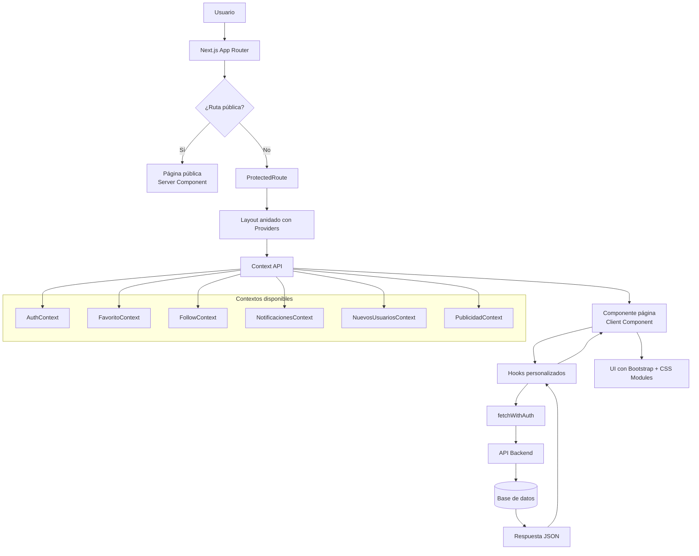

# Documentación del Proyecto: Tlaxcala en Imágenes App (TlaxApp)

## 1. Resumen General

**TlaxApp** es una red social enfocada en el estado de Tlaxcala, México. Su propósito es permitir a los usuarios compartir fotografías, seguir perfiles, dar *likes*, comentar publicaciones, guardar favoritos y descubrir lugares, negocios y experiencias de la región. La plataforma está construida con un enfoque *mobile-first* e incluye autenticación por *JWT* con *refresh* automático, notificaciones *push* y optimización de imágenes mediante *Cloudinary*.

**Usuarios objetivo**: Residentes de Tlaxcala, turistas locales, negocios locales y creadores de contenido interesados en promover la cultura y los lugares del estado.

---

## 2. Stack Tecnológico

| Tecnología | Versión | Propósito |
|---|---|---|
| Next.js | 16.2.6 | *Framework* principal con *App Router* y *Server Components* |
| React | 19.2.6 | Biblioteca de interfaz de usuario |
| TypeScript | 6.0.3 | Tipado estático |
| Bootstrap | 5.3.8 | *Framework* de estilos y sistema de cuadrícula |
| CSS Modules | — | Estilos encapsulados por componente |
| Framer Motion | 12.38.0 | Animaciones y transiciones |
| react-hook-form | 7.75.0 | Manejo de formularios |
| Zod | 4.4.3 | Validación de esquemas de datos |
| react-hook-form resolvers | 5.2.2 | Integración Zod + react-hook-form |
| react-icons | 5.6.0 | Íconos vectoriales |
| date-fns | 4.1.0 | Manipulación de fechas |
| @popperjs/core | 2.11.8 | *Tooltips* y *popovers* de Bootstrap |
| Cloudinary | — | Almacenamiento y optimización de imágenes |
| pnpm | — | Gestor de paquetes |

---

## 3. Requisitos Previos

- **Node.js** versión 22 o superior (recomendada)
- **pnpm** como gestor de paquetes (instalar con `npm install -g pnpm`)
- Acceso a una instancia del backend API (ver variables de entorno)
- Cuenta de Cloudinary para el manejo de imágenes
- Navegador moderno con soporte para *Service Worker* y *Push API* (para notificaciones)

---

## 4. Instalación y Configuración

```bash
# 1. Clonar el repositorio
git clone <url-del-repositorio>
cd tlaxcala-en-imagenes-app

# 2. Instalar dependencias
pnpm install

# 3. Configurar variables de entorno
# Copiar el archivo de ejemplo y completar los valores
cp .env.example .env

# 4. Iniciar en modo desarrollo
pnpm dev

# 5. Construir para producción
pnpm build

# 6. Iniciar servidor de producción
pnpm start
```

---

## 5. Variables de Entorno

| Variable | Requerida | Utilizada en | Descripción | Ejemplo |
|---|---|---|---|---|
| `NEXT_PUBLIC_BASE_URL` | Sí | Layout, páginas, SEO | URL pública del frontend | `https://tlaxapp.com` |
| `NEXT_PUBLIC_API_URL` | Sí | actions, context, hooks | URL base de la API backend | `https://api.tlaxapp.com` |
| `NEXT_PUBLIC_CLOUDINARY_NAME` | Sí | getCloudinaryUrl | Nombre del *cloud* de Cloudinary | `dy9prn3ue` |
| `NEXT_PUBLIC_IMAGEN_PERFIL_DEFAULT` | Sí | obtenerImagenPerfilUsuario | URL de la imagen de perfil por defecto | `https://res.cloudinary.com/.../default.jpg` |
| `CORREO_USUARIO_PRINCIPAL` | No | (uso interno) | Correo principal del sistema | `admin@tlaxapp.com` |
| `CORREO_CONTACTO` | No | Página de contacto | Correo de atención al usuario | `contacto@tlaxapp.com` |
| `CORREO_LEGAL` | No | (uso interno) | Correo para asuntos legales | `legal@tlaxapp.com` |

---

## 6. Scripts Disponibles

| Script | Comando | Descripción |
|---|---|---|
| `dev` | `pnpm dev` | Inicia el servidor de desarrollo con *Turbopack* |
| `build` | `pnpm build` | Compila el proyecto para producción |
| `start` | `pnpm start` | Inicia el servidor de producción |

---

## 7. Arquitectura del Proyecto

### 7.1 Estructura de Carpetas

```
tlaxcala-en-imagenes-app/
├── .env.example              # Variables de entorno de ejemplo
├── next.config.ts            # Configuración de Next.js
├── tsconfig.json              # Configuración de TypeScript
├── package.json               # Dependencias y scripts
├── pnpm-lock.yaml             # Lockfile de pnpm
├── opencode.json              # Configuración de asistentes IA
├── README.md                  # Documentación rápida
│
├── public/                    # Archivos estáticos
│   ├── assets/                # Recursos gráficos
│   │   ├── icono-tlaxapp-beige.png
│   │   ├── icono-tlaxapp-blanco.png
│   │   └── og-image.png       # Imagen para Open Graph
│   ├── sw.js                  # Service Worker para notificaciones push
│   └── google-icone-symbole-logo-png.ico
│
└── src/                       # Código fuente
    ├── app/                   # Directorio principal (App Router)
    │   ├── layout.tsx         # Layout raíz con providers
    │   ├── page.tsx           # Landing page (pública)
    │   ├── error.tsx          # Página de error global
    │   ├── not-found.tsx      # Página 404
    │   ├── robots.ts          # Configuración de robots.txt
    │   ├── sitemap.ts         # Generación de sitemap.xml
    │   │
    │   ├── (perfil)/          # Grupo de rutas para perfil
    │   │   └── [url]/         # Ruta dinámica de perfil de usuario
    │   │       ├── layout.tsx # Layout protegido con FavoritoProvider
    │   │       ├── page.tsx   # Página de perfil de usuario
    │   │       ├── loading.tsx
    │   │       └── not-found.tsx
    │   │
    │   ├── inicio/            # Feed principal
    │   │   ├── layout.tsx     # Layout con ProtectedRoute + FavoritoProvider
    │   │   └── page.tsx       # Feed de publicaciones
    │   │
    │   ├── cuentas/           # Módulo de autenticación
    │   │   ├── login/         # Inicio de sesión
    │   │   │   ├── layout.tsx
    │   │   │   ├── page.tsx
    │   │   │   ├── components/
    │   │   │   ├── password-olvidado/   # Recuperación de contraseña
    │   │   │   └── restablecer-password/ # Restablecer contraseña
    │   │   ├── crear-cuenta/  # Registro de usuario
    │   │   │   ├── layout.tsx
    │   │   │   ├── page.tsx
    │   │   │   ├── components/
    │   │   │   └── cuenta-verificada/   # Confirmación de cuenta
    │   │   └── confirmacion/  # Confirmación de correo
    │   │
    │   ├── posteo/            # Detalle de publicación
    │   │   └── [idposteo]/    # Ruta dinámica de posteo
    │   │
    │   ├── configuracion/     # Configuración de usuario
    │   │   ├── layout.tsx     # Layout protegido
    │   │   ├── page.tsx       # Panel de configuración
    │   │   ├── editar-perfil/ # Editar información personal
    │   │   ├── notificaciones/ # Preferencias de notificaciones
    │   │   ├── ayuda-y-soporte/ # Formulario de ayuda
    │   │   ├── eliminar-cuenta/ # Eliminación de cuenta
    │   │   └── faq/           # Preguntas frecuentes
    │   │
    │   ├── notificaciones/    # Centro de notificaciones
    │   │   ├── layout.tsx
    │   │   └── page.tsx
    │   │
    │   ├── favoritos/         # Publicaciones favoritas
    │   │   ├── layout.tsx
    │   │   └── page.tsx
    │   │
    │   ├── contacto/          # Página de contacto (pública)
    │   │   └── page.tsx
    │   │
    │   ├── legal/             # Páginas legales (públicas)
    │   │   ├── terminos-y-condiciones/page.tsx
    │   │   ├── politica-de-privacidad/page.tsx
    │   │   └── preguntas-frecuentes/page.tsx
    │   │
    │   ├── que-es-tlaxapp/    # Página "Acerca de" (pública)
    │   │   └── page.tsx
    │   │
    │   ├── components/        # Componentes de la aplicación
    │   │   ├── inicio/        # Componentes del feed
    │   │   │   └── PublicacionUsuario.tsx
    │   │   ├── perfil/        # Componentes de perfil
    │   │   │   ├── PerfilUsuarioContainer.tsx
    │   │   │   ├── InformacionUsuarioPerfil.tsx
    │   │   │   ├── PublicacionesUsuarioGrid.tsx
    │   │   │   ├── FollowersModal.tsx
    │   │   │   ├── FollowingModal.tsx
    │   │   │   └── ImageModal.tsx
    │   │   ├── posteo/        # Componentes de posteo
    │   │   │   ├── ComentariosSection.tsx
    │   │   │   └── EditarPosteoModal.tsx
    │   │   ├── notifications/ # Componentes de notificaciones
    │   │   │   ├── Notificaciones.tsx
    │   │   │   └── NotificacionItem.tsx
    │   │   ├── favoritos/     # Componentes de favoritos
    │   │   │   └── Favoritos.tsx
    │   │   ├── configuracion/ # Componentes de configuración
    │   │   │   ├── editar-perfil/
    │   │   │   ├── notificaciones/
    │   │   │   ├── ayuda-y-soporte/
    │   │   │   └── eliminar-cuenta-usuario/
    │   │   ├── CambiarImagenModal.tsx
    │   │   ├── ComentarioItem.tsx
    │   │   ├── ComentariosModal.tsx
    │   │   ├── Configuraciones.tsx
    │   │   ├── CrearPosteoModal.tsx
    │   │   ├── EditarPerfil.tsx
    │   │   ├── FavoritoButton.tsx
    │   │   ├── FollowButton.tsx
    │   │   ├── FooterMain.tsx
    │   │   ├── FooterSugerencias.tsx
    │   │   ├── HeaderPrincipalTei.tsx
    │   │   ├── HeaderSuperior.tsx
    │   │   ├── ImagePreloader.tsx
    │   │   ├── LikeButton.tsx
    │   │   ├── ManualMunicipioSelector.tsx
    │   │   ├── MenuPrincipal.tsx
    │   │   ├── ModalLikesUsuarios.tsx
    │   │   ├── ModalOpcionesPublicacion.tsx
    │   │   ├── NuevosUsuariosRegistrados.tsx
    │   │   ├── PosteoCard.tsx
    │   │   ├── PosteoDetalle.tsx
    │   │   ├── PublicacionesUsuarioGridItem.tsx
    │   │   ├── Publicidad.tsx
    │   │   ├── spinner.tsx
    │   │   └── ToastGlobal.tsx
    │   │
    │   ├── hooks/             # Hooks personalizados
    │   │   ├── auth/
    │   │   │   └── logout.ts
    │   │   ├── useComentarios.ts
    │   │   ├── useCrearPosteo.ts
    │   │   ├── useEditarPerfil.ts
    │   │   ├── useInfinitePosts.ts
    │   │   ├── useLikes.ts
    │   │   ├── useLikesModal.ts
    │   │   ├── useNotifications.tsx
    │   │   ├── useObtenerUbicacion.ts
    │   │   ├── usePushNotifications.ts
    │   │   └── useUsuarioPerfil.ts
    │   │
    │   └── ui/                # Estilos (CSS Modules)
    │       ├── fonts.ts       # Configuración de Google Fonts
    │       ├── globals.css    # Estilos globales
    │       ├── Home.module.css
    │       ├── error.css
    │       ├── not-found.css
    │       ├── configuracion/
    │       ├── cuentas/
    │       ├── favoritos/
    │       ├── inicio/
    │       ├── legal/
    │       ├── perfil/
    │       └── posteos/
    │
    ├── components/            # Componentes compartidos globales
    │   ├── AlreadyAuthRedirect.tsx  # Redirección si ya hay sesión
    │   └── ProtectedRoute.tsx       # Protección de rutas autenticadas
    │
    ├── context/               # Contextos de React (Estado global)
    │   ├── AuthContext.tsx
    │   ├── FavoritoContext.tsx
    │   ├── FollowContext.tsx
    │   ├── NotificacionesContext.tsx
    │   ├── NuevosUsuariosContext.tsx
    │   └── PublicidadContext.tsx
    │
    ├── lib/                   # Lógica de negocio y utilidades
    │   ├── actions.ts         # Funciones de creación de usuarios
    │   ├── validaciones.ts    # Esquemas de validación Zod
    │   └── cloudinary/        # Utilidades de Cloudinary
    │       ├── getCloudinaryUrl.ts
    │       └── obtenerImagenPerfilUsuario.ts
    │
    ├── types/                 # Definiciones de tipos TypeScript
    │   └── types.ts
    │
    └── utils/                 # Utilidades generales
        └── handleChange.ts    # Manejador genérico de cambios en inputs
```

### 7.2 Patrón Arquitectónico

El proyecto utiliza una **arquitectura híbrida** que combina:

- **App Router de Next.js 16**: Enrutamiento basado en el sistema de archivos con *layouts anidados*, *Server Components* y *Client Components*.
- **Patrón de capas**: Separación en `components`, `context`, `hooks`, `lib`, `types` y `utils`.
- **Agrupación por funcionalidad (*feature-based*)**: Dentro de `src/app/`, cada módulo (inicio, cuentas, configuracion, etc.) agrupa sus propias páginas, componentes y estilos.
- **Estado global con Context API**: Se utilizan 6 contextos para manejar autenticación, favoritos, seguimiento, notificaciones, nuevos usuarios y publicidad.
- **Server Components + Client Components**: Las páginas son *Server Components* por defecto, y los componentes interactivos se marcan con `'use client'`.

### 7.3 Flujo de Datos



**Flujo de autenticación**:
1. El usuario inicia sesión → la API establece una cookie `httpOnly` con el *JWT*.
2. `AuthContext` verifica la sesión llamando a `/api/auth/me` al cargar la aplicación.
3. Si el *token* expiró, se llama automáticamente a `/api/auth/refresh` para renovarlo.
4. Todas las peticiones autenticadas usan `fetchWithAuth` que incluye `credentials: 'include'` para enviar cookies y maneja renovación automática en caso de error 401.

---

## 8. Enrutamiento

| Ruta | Componente | Protegida | Carga Diferida | Descripción |
|---|---|---|---|---|
| `/` | `Home` (page.tsx) | No (con AlreadyAuthRedirect) | No | *Landing page* pública |
| `/inicio` | `Inicio` | Sí (ProtectedRoute) | No | *Feed* principal de publicaciones |
| `/cuentas/login` | `LoginPage` | Solo no auth | No | Inicio de sesión |
| `/cuentas/crear-cuenta` | `CrearCuentaPage` | Solo no auth | No | Registro de usuario |
| `/cuentas/confirmacion` | `ConfirmacionPage` | No | No | Confirmación de correo |
| `/cuentas/login/password-olvidado` | `PasswordOlvidado` | No | No | Recuperación de contraseña |
| `/cuentas/login/restablecer-password` | `RestablecerPassword` | No | No | Restablecer contraseña |
| `/posteo/[idposteo]` | `PosteoDetalle` | Sí | No | Detalle de publicación |
| `/[url]` | `PerfilUsuarioPage` | Sí | No | Perfil de usuario (URL dinámica) |
| `/configuracion` | `ConfiguracionPage` | Sí | No | Panel de configuración |
| `/configuracion/editar-perfil` | `EditarPerfil` | Sí | No | Editar información personal |
| `/configuracion/notificaciones` | `NotificacionesConfig` | Sí | No | Preferencias de notificaciones |
| `/configuracion/ayuda-y-soporte` | `AyudaSoporte` | Sí | No | Formulario de ayuda |
| `/configuracion/eliminar-cuenta` | `EliminarCuenta` | Sí | No | Eliminación de cuenta |
| `/configuracion/faq` | `FAQConfig` | Sí | No | Preguntas frecuentes |
| `/notificaciones` | `NotificacionesPage` | Sí | No | Centro de notificaciones |
| `/favoritos` | `FavoritoPage` | Sí | No | Publicaciones favoritas |
| `/contacto` | `Contacto` | No | No | Página de contacto |
| `/legal/terminos-y-condiciones` | `TerminosPage` | No | No | Términos y condiciones |
| `/legal/politica-de-privacidad` | `PrivacidadPage` | No | No | Política de privacidad |
| `/legal/preguntas-frecuentes` | `FAQPage` | No | No | Preguntas frecuentes |
| `/que-es-tlaxapp` | `QueEsTlaxApp` | No | No | Página "Acerca de" |

### Mecanismos de protección de rutas:
- **`ProtectedRoute`**: Verifica si el usuario está autenticado. Si no, redirige a `/cuentas/login`.
- **`AlreadyAuthRedirect`**: Si el usuario ya tiene sesión activa, redirige a `/inicio`.
- Las páginas protegidas tienen `robots.index = false` para evitar su indexación.

---

## 9. Gestión de Estado

El proyecto utiliza **Context API de React** para la gestión de estado global. No se emplean librerías externas como Redux o Zustand.

### 9.1 AuthContext (`src/context/AuthContext.tsx`)

**Propósito**: Manejar la autenticación del usuario (inicio de sesión, cierre de sesión, verificación de sesión, renovación de *token*).

**Estado**:
- `user: UsuarioLogueado | null` — Datos del usuario autenticado
- `loading: boolean` — Estado de carga inicial

**Acciones**:
- `login(user)` — Establece el usuario en el estado y limpia variables de sesión
- `logout()` — Llama a `/api/auth/logout` y limpia el estado
- `updateUser(newData)` — Actualización parcial del usuario en memoria
- `fetchWithAuth(input, init)` — *Fetch* con renovación automática de *token*

**Efectos secundarios**:
- Al montar, verifica la sesión con `/api/auth/me` e intenta renovar si hay error 401

### 9.2 FavoritoContext (`src/context/FavoritoContext.tsx`)

**Propósito**: Gestionar el estado de favoritos de publicaciones de forma global.

**Estado**:
- `favoritosMap: Record<string, boolean>` — Mapa de ID de posteo a estado favorito
- `loadingMap: Record<string, boolean>` — Estados de carga por posteo

**Acciones**:
- `toggleFavorito(posteoId, autorId, initialFavorito?)` — Agrega o elimina un favorito

### 9.3 FollowContext (`src/context/FollowContext.tsx`)

**Propósito**: Gestionar el estado de seguimiento entre usuarios de forma global.

**Estado**:
- `isFollowingMap: Record<string, boolean>` — Mapa de ID de usuario a estado de seguimiento
- `loadingMap: Record<string, boolean>` — Estados de carga por usuario

**Acciones**:
- `toggleFollow(userId, initialFollowing?)` — Sigue o deja de seguir a un usuario

### 9.4 NotificacionesContext (`src/context/NotificacionesContext.tsx`)

**Propósito**: Mantener el contador global de notificaciones no leídas.

**Estado**:
- `totalNoLeidas: number` — Total de notificaciones no leídas
- `setTotalNoLeidas: Dispatch<SetStateAction<number>>` — Actualizar contador

**Acciones**:
- `refrescarNotificaciones()` — Obtiene el total desde la API

**Efectos secundarios**:
- Cada 60 segundos actualiza el contador automáticamente

### 9.5 NuevosUsuariosContext (`src/context/NuevosUsuariosContext.tsx`)

**Propósito**: Obtener y proveer la lista de usuarios registrados recientemente para sugerencias de seguimiento.

**Estado**:
- `usuarios: UsuarioNuevo[]` — Lista de usuarios nuevos
- `loading: boolean` — Estado de carga

**Acciones**:
- `reload()` — Recarga manual de la lista

### 9.6 PublicidadContext (`src/context/PublicidadContext.tsx`)

**Propósito**: Controlar la rotación de anuncios publicitarios.

**Estado**:
- `anuncioActual` — Anuncio actualmente visible
- `indice: number` — Índice del anuncio actual

**Acciones**:
- `pausar()` — Detiene la rotación automática
- `reanudar()` — Reanuda la rotación cada 8 segundos

---

## 10. Capa de API

### 10.1 Endpoints detectados en el código fuente

| Método | Ruta | Descripción | Autenticación |
|---|---|---|---|
| GET | `/api/auth/me` | Obtener datos del usuario autenticado | Cookie JWT |
| POST | `/api/auth/refresh` | Renovar *token* de acceso | Cookie JWT |
| POST | `/api/auth/logout` | Cerrar sesión | Cookie JWT |
| POST | `/api/usuarios` | Crear nuevo usuario | No |
| POST | `/api/auth/reenviar-correo` | Reenviar correo de verificación | Token |
| POST | `/api/auth/reenviar-correo-restablecer-password` | Reenviar correo para restablecer contraseña | Token |
| POST | `/api/auth/cuentas/password-olvidado` | Enviar correo para restablecer contraseña | No |
| GET | `/api/auth/cuentas/restablecer-password/validar-token-reset-password/:token` | Validar token de restablecimiento | Token |
| GET | `/api/posteos` | Obtener publicaciones (con paginación) | Cookie JWT |
| POST | `/api/posteos` | Crear nueva publicación | Cookie JWT |
| GET | `/api/posteos/:id` | Obtener detalle de publicación | Cookie JWT |
| GET | `/api/usuarios/:url` | Obtener perfil de usuario | Cookie JWT |
| PUT | `/api/usuarios/update` | Actualizar perfil de usuario | Cookie JWT |
| GET | `/api/comentarios/:postId/comentarios` | Obtener comentarios de un posteo | Cookie JWT |
| GET | `/api/comentarios/:postId/comentarios/count` | Obtener total de comentarios | Cookie JWT |
| POST | `/api/comentarios/:postId/comentarios` | Crear comentario | Cookie JWT |
| DELETE | `/api/comentarios/:commentId` | Eliminar comentario | Cookie JWT |
| GET | `/api/likes/:postId/likes/usuarios` | Obtener usuarios que dieron *like* | Cookie JWT |
| POST | `/api/likes/:postId/like` | Dar o quitar *like* | Cookie JWT |
| POST | `/api/favoritos/:posteoId` | Agregar a favoritos | Cookie JWT |
| DELETE | `/api/favoritos/:posteoId` | Eliminar de favoritos | Cookie JWT |
| POST | `/api/followers/follow/:userId` | Seguir usuario | Cookie JWT |
| DELETE | `/api/followers/unfollow/:userId` | Dejar de seguir usuario | Cookie JWT |
| GET | `/api/notificaciones` | Obtener notificaciones (paginadas) | Cookie JWT |
| GET | `/api/notificaciones/nuevas-notificaciones` | Obtener total de no leídas | Cookie JWT |
| PATCH | `/api/notificaciones/marcar-notificacion-leida/:id` | Marcar notificación como leída | Cookie JWT |
| DELETE | `/api/notificaciones/eliminar-notificacion/:id` | Eliminar notificación | Cookie JWT |
| GET | `/api/notificaciones/vapidPublicKey` | Obtener clave pública VAPID | Cookie JWT |
| POST | `/api/notificaciones/subscribe` | Suscribir a notificaciones *push* | Cookie JWT |
| POST | `/api/notificaciones/unsubscribe` | Cancelar suscripción *push* | Cookie JWT |
| GET | `/api/municipios/` | Obtener lista de municipios | Cookie JWT |
| POST | `/api/ubicacion/reverse` | Convertir coordenadas a municipio | Cookie JWT |
| GET | `/api/usuarios/registrados/nuevos-usuarios-registrados` | Obtener nuevos usuarios registrados | Cookie JWT |

### Estrategia de autenticación

Todas las peticiones autenticadas utilizan `credentials: 'include'` para enviar y recibir cookies HTTP-only que contienen el *JWT*. El mecanismo de renovación automática se implementa en `AuthContext.fetchWithAuth`: si la respuesta es 401, se llama a `/api/auth/refresh` y se reintenta la solicitud original.

### Manejo de errores

- Las funciones en `actions.ts` manejan errores específicos de la API según `status` y `msg`.
- Los hooks manejan errores con bloques `try/catch` y actualizan el estado local.
- El componente `ToastGlobal` muestra notificaciones visuales de éxito o error.

---

## 11. Componentes

A continuación se documentan los componentes exportados y reutilizables más relevantes del proyecto.

### AlreadyAuthRedirect

**Ubicación:** `src/components/AlreadyAuthRedirect.tsx`
**Descripción:** Redirige al usuario a `/inicio` si ya tiene una sesión activa.

**Props**
| Prop | Tipo | Requerida | Valor por Defecto | Descripción |
|---|---|---|---|---|
| children | ReactNode | Sí | — | Contenido a renderizar si no hay sesión |

**Estado Interno** — No tiene. | **Efectos Secundarios** — useEffect que redirige con `router.replace`. | **Dependencias** — AuthContext (useAuth). |
**Accesibilidad** — No aplica. | **Responsive** — No aplica. | **Rendimiento** — No aplica.

---

### ProtectedRoute

**Ubicación:** `src/components/ProtectedRoute.tsx`
**Descripción:** Protege rutas que requieren autenticación. Muestra un *spinner* mientras verifica y redirige a `/cuentas/login` si no hay sesión.

**Props**
| Prop | Tipo | Requerida | Valor por Defecto | Descripción |
|---|---|---|---|---|
| children | ReactNode | Sí | — | Contenido protegido |

**Estado Interno** — No tiene. | **Efectos Secundarios** — useEffect que redirige si no hay usuario. | **Dependencias** — AuthContext (useAuth), useRouter. |
**Accesibilidad** — Incluye `Spinner` con etiqueta semántica. | **Responsive** — Clases Bootstrap `d-flex`, `vh-100`. | **Rendimiento** — No aplica.

---

### MenuPrincipal

**Ubicación:** `src/app/components/MenuPrincipal.tsx`
**Descripción:** Barra de navegación principal con enlaces a Inicio, Notificaciones, Crear Posteo, Configuración y Perfil. Incluye *dropdown* con acceso a Favoritos, Mi perfil y Notificaciones. Muestra *badge* con el contador de notificaciones no leídas.

**Props**
| Prop | Tipo | Requerida | Valor por Defecto | Descripción |
|---|---|---|---|---|
| onPostCreated | `() => void` | No | — | *Callback* tras crear una publicación |

**Estado Interno** — `dropdownOpen`, `showModal`, `showCrearPost`. | **Efectos Secundarios** — Cierra *dropdown* al hacer clic fuera; bloquea scroll al abrir modales; actualiza notificaciones cada 60s. | **Dependencias** — AuthContext, NotificacionesContext, useLogout. |
**Accesibilidad** — Etiquetas `aria-label` en todos los enlaces y botones; atributo `role="navigation"`. | **Responsive** — Menú inferior fijo en móvil, lateral en escritorio (clases Bootstrap). | **Rendimiento** — No aplica.

---

### HeaderSuperior

**Ubicación:** `src/app/components/HeaderSuperior.tsx`
**Descripción:** Encabezado superior con el logotipo y nombre de la aplicación. Enlace a `/inicio`.

**Props** — No recibe props.

**Estado Interno** — No tiene. | **Efectos Secundarios** — No tiene. | **Dependencias** — No tiene. |
**Accesibilidad** — `role="banner"`, `aria-label` en el enlace, `alt` descriptivo en la imagen. | **Responsive** — Estilos adaptables. | **Rendimiento** — Imagen con `priority`.

---

### PosteoCard

**Ubicación:** `src/app/components/PosteoCard.tsx`
**Descripción:** Tarjeta de publicación que muestra la imagen, usuario, texto, fecha, ubicación, botones de *like*, comentarios y menú de opciones. Se adapta para vista de detalle.

**Props**
| Prop | Tipo | Requerida | Valor por Defecto | Descripción |
|---|---|---|---|---|
| post | Posteo | Sí | — | Datos de la publicación |
| isDetail | boolean | No | false | Modo de detalle (tamaño completo) |
| showUserUrl | boolean | No | false | Mostrar nombre completo del usuario |

**Estado Interno** — `isOptionsOpen`, `isLikesOpen`, `likesUsuarios`, `loaded`, `posteoActual`, `showComments`. | **Efectos Secundarios** — Uso de `useComentarios` para obtener total de comentarios. | **Dependencias** — AuthContext, LikeButton, ComentariosModal, ModalOpcionesPublicacion, ModalLikesUsuarios, getCloudinaryUrl, obtenerImagenPerfilUsuario. |
**Accesibilidad** — Atributos `aria-label` en enlaces y botones; `alt` descriptivo en imágenes. | **Responsive** — Imagen con `fill` y `sizes` adaptables; diseño con Bootstrap `card`. | **Rendimiento** — Imagen con `priority` en modo detalle, `loading="eager"`, efecto `fadeIn`.

---

### CrearPosteoModal

**Ubicación:** `src/app/components/CrearPosteoModal.tsx`
**Descripción:** Modal para crear una nueva publicación. Permite seleccionar imagen (arrastrar, cámara o galería), escribir descripción, elegir ubicación (GPS o manual) y configurar privacidad.

**Props**
| Prop | Tipo | Requerida | Valor por Defecto | Descripción |
|---|---|---|---|---|
| show | boolean | Sí | — | Controla la visibilidad del modal |
| onClose | `() => void` | Sí | — | Función al cerrar el modal |
| onPostCreated | `(newPost?: Posteo) => void` | No | — | *Callback* tras crear publicación |

**Estado Interno** — `toastMessage`, `toastType`. | **Efectos Secundarios** — Toast automático; confirmación de descarte. | **Dependencias** — useCrearPosteo, ManualMunicipioSelector, ToastGlobal. |
**Accesibilidad** — Etiquetas `htmlFor` en inputs, `aria-label` en botones. | **Responsive** — Adaptable a móvil con botones de cámara/galería. | **Rendimiento** — Lazy loading de imagen preview.

---

### LikeButton

**Ubicación:** `src/app/components/LikeButton.tsx`
**Descripción:** Botón de "me gusta" con contador. Permite dar o quitar *like* a una publicación.

**Props**
| Prop | Tipo | Requerida | Valor por Defecto | Descripción |
|---|---|---|---|---|
| postId | string | Sí | — | ID de la publicación |
| onOpenLikesModal | `() => void` | No | — | *Callback* para abrir modal de likes |

**Estado Interno** — Manejado por `useLikes`. | **Efectos Secundarios** — `useLikes` obtiene y actualiza el estado de likes. | **Dependencias** — useLikes. |
**Accesibilidad** — `aria-label="Boton like"`, botón deshabilitado durante carga. | **Responsive** — No aplica. | **Rendimiento** — *Spinner* durante carga.

---

### FollowButton

**Ubicación:** `src/app/components/FollowButton.tsx`
**Descripción:** Botón para seguir o dejar de seguir a un usuario. Cambia de color y texto según el estado.

**Props**
| Prop | Tipo | Requerida | Valor por Defecto | Descripción |
|---|---|---|---|---|
| userId | string | Sí | — | ID del usuario a seguir |
| initialFollowing | boolean | Sí | — | Estado inicial de seguimiento |
| className | string | No | `""` | Clases CSS adicionales |
| onToggle | `(newState: boolean) => void` | No | — | *Callback* al cambiar estado |

**Estado Interno** — Maneja estado local del seguimiento desde FollowContext. | **Efectos Secundarios** — Llama a `toggleFollow` del FollowContext. | **Dependencias** — FollowContext. |
**Accesibilidad** — Botón deshabilitado durante operación. | **Responsive** — No aplica. | **Rendimiento** — Spinner durante operación.

---

### ToastGlobal

**Ubicación:** `src/app/components/ToastGlobal.tsx`
**Descripción:** Notificación flotante global con animación de entrada/salida. Soporta tipos: `success`, `danger`, `warning`, `creacion`.

**Props**
| Prop | Tipo | Requerida | Valor por Defecto | Descripción |
|---|---|---|---|---|
| message | string | Sí | — | Mensaje a mostrar |
| type | `"success" \| "danger" \| "warning" \| "creacion"` | No | `"creacion"` | Tipo de notificación |
| onClose | `() => void` | No | — | *Callback* al cerrar |

**Estado Interno** — No tiene. | **Efectos Secundarios** — Cierre automático tras 4 segundos. | **Dependencias** — Framer Motion (`motion`, `AnimatePresence`). |
**Accesibilidad** — Botón de cerrar con `aria-label="Cerrar"`. | **Responsive** — Posición fija centrada. | **Rendimiento** — No aplica.

---

### Publicidad

**Ubicación:** `src/app/components/Publicidad.tsx`
**Descripción:** Componente de publicidad que muestra anuncios rotativos cada 8 segundos.

**Props** — No recibe props.

**Estado Interno** — Controlado por PublicidadContext. | **Efectos Secundarios** — No tiene directos. | **Dependencias** — PublicidadContext. |
**Accesibilidad** — Imágenes con `alt` descriptivo. | **Responsive** — Oculto en pantallas menores a 1200px. | **Rendimiento** — No aplica.

---

### NuevosUsuariosRegistrados

**Ubicación:** `src/app/components/NuevosUsuariosRegistrados.tsx`
**Descripción:** Muestra una lista de usuarios registrados recientemente para sugerir seguimiento.

**Props** — No recibe props (usa contexto).

**Estado Interno** — No tiene (usa NuevosUsuariosContext). | **Efectos Secundarios** — No tiene directos. | **Dependencias** — NuevosUsuariosContext, FollowButton. |
**Accesibilidad** — Enlaces a perfiles. | **Responsive** — Oculto en pantallas menores a 1200px. | **Rendimiento** — No aplica.

---

### CambiarImagenModal

**Ubicación:** `src/app/components/CambiarImagenModal.tsx`
**Descripción:** Modal para cambiar la imagen de perfil del usuario.

**Props**
| Prop | Tipo | Requerida | Valor por Defecto | Descripción |
|---|---|---|---|---|
| usuario | UsuarioLogueado | Sí | — | Datos del usuario |
| show | boolean | Sí | — | Control de visibilidad |
| onClose | `() => void` | Sí | — | *Callback* al cerrar |
| onSuccess | `(newUrl: string) => void` | Sí | — | *Callback* con nueva URL |

---

### PerfilUsuarioContainer

**Ubicación:** `src/app/components/perfil/PerfilUsuarioContainer.tsx`
**Descripción:** Contenedor principal del perfil de usuario que integra la información del perfil y la cuadrícula de publicaciones.

**Props**
| Prop | Tipo | Requerida | Valor por Defecto | Descripción |
|---|---|---|---|---|
| url | string | Sí | — | URL/username del perfil |

---

### ComentariosSection

**Ubicación:** `src/app/components/posteo/ComentariosSection.tsx`
**Descripción:** Sección de comentarios para la vista de detalle de publicación. Incluye formulario de envío y lista de comentarios.

---

### Notificaciones

**Ubicación:** `src/app/components/notifications/Notificaciones.tsx`
**Descripción:** Lista de notificaciones del usuario con soporte de paginación. Permite marcar como leídas y eliminar.

---

### Favoritos

**Ubicación:** `src/app/components/favoritos/Favoritos.tsx`
**Descripción:** Lista de publicaciones favoritas del usuario con paginación.

---

### Configuraciones

**Ubicación:** `src/app/components/Configuraciones.tsx`
**Descripción:** Panel de configuración que agrupa las opciones de editar perfil, notificaciones, ayuda, etc.

---

## 12. Hooks Personalizados

### useAuth

**Ubicación:** `src/context/AuthContext.tsx` (exportado como hook)
**Descripción:** Hook para acceder al contexto de autenticación.

**Retorno** — `IAuthContext` con `user`, `loading`, `login`, `logout`, `fetchWithAuth`, `updateUser`.

---

### useInfinitePosts

**Ubicación:** `src/app/hooks/useInfinitePosts.ts`
**Descripción:** Hook para carga de publicaciones con *scroll infinito* usando `IntersectionObserver`.

**Parámetros** — `initialUrl: string` — URL inicial de la API.

**Retorno** — `{ posts, loading, observerRef, finished, updateFollowState, updateFavoritoState }`.

**Ejemplo de Uso:**
```tsx
const { posts, loading, observerRef, finished } = useInfinitePosts(
  `${process.env.NEXT_PUBLIC_API_URL}/api/posteos`
);
```

---

### useComentarios

**Ubicación:** `src/app/hooks/useComentarios.ts`
**Descripción:** Hook para gestionar comentarios de una publicación: cargar, crear, eliminar y paginar.

**Parámetros** — `postId: string` — ID de la publicación.

**Retorno** — `{ comentarios, total, loadingList, loadingMore, hasMore, fetchComentarios, fetchTotal, cargarMasComentarios, agregarComentario, eliminarComentario }`.

---

### useCrearPosteo

**Ubicación:** `src/app/hooks/useCrearPosteo.ts`
**Descripción:** Hook que maneja la lógica del formulario de creación de publicaciones: validación de imagen, texto, ubicación y envío a la API.

**Parámetros** — `onPostCreated?`, `onSuccess?`.

**Retorno** — `{ file, preview, texto, posteoPublico, loading, errors, isMobile, processFile, handleSubmit, resetForm, obtenerUbicacion, lat, lng, municipioId, ciudad, estado, pais, ... }`.

---

### useLikes

**Ubicación:** `src/app/hooks/useLikes.ts`
**Descripción:** Hook para manejar el estado de "me gusta" de una publicación: obtener estado inicial y alternar *like*.

**Parámetros** — `postId: string`.

**Retorno** — `{ likeState: { count, hasLiked }, toggleLike, loading }`.

---

### useLikesModal

**Ubicación:** `src/app/hooks/useLikesModal.ts`
**Descripción:** Hook para manejar la apertura/cierre del modal de usuarios que dieron *like* y la carga de datos.

**Retorno** — `{ isLikesOpen, likesUsuarios, loading, openLikesModal, closeLikesModal }`.

---

### useNotifications

**Ubicación:** `src/app/hooks/useNotifications.tsx`
**Descripción:** Hook para gestionar la lista de notificaciones con paginación, marcado como leídas y eliminación.

**Retorno** — `{ notificaciones, page, totalPages, loading, loadingMore, cargarNotificaciones, marcarComoLeida, eliminarNotificacion, setLoadingMore, setNotificaciones }`.

---

### usePushNotifications

**Ubicación:** `src/app/hooks/usePushNotifications.ts`
**Descripción:** Hook para activar/desactivar notificaciones *push* usando la *Web Push API* y *Service Worker*.

**Retorno** — `{ estado: "idle" | "pending" | "enabled" | "disabled" | "error", activarNotificaciones, desactivarNotificaciones }`.

---

### useObtenerUbicacion

**Ubicación:** `src/app/hooks/useObtenerUbicacion.ts`
**Descripción:** Hook para obtener la ubicación del usuario mediante la API de geolocalización del navegador y convertir coordenadas a municipio a través del backend.

**Retorno** — `{ lat, lng, obtenerUbicacion, loadingUbicacion, ubicacionError, municipioId, ciudad, estado, pais, setMunicipioId, setCiudad, setEstado, setPais, setLat, setLng }`.

---

### useEditarPerfil

**Ubicación:** `src/app/hooks/useEditarPerfil.ts`
**Descripción:** Hook con toda la lógica del formulario de edición de perfil: carga de municipios, validación Zod, envío a la API y actualización del contexto.

**Retorno** — `{ user, formData, errors, municipios, imagenPerfil, showModal, loading, toast, setToast, setShowModal, setImagenPerfil, handleChange, handleSubmit }`.

---

### useUsuarioPerfil

**Ubicación:** `src/app/hooks/useUsuarioPerfil.ts`
**Descripción:** Hook para obtener los datos del perfil de un usuario por su URL.

**Parámetros** — `url: string | undefined`.

**Retorno** — `{ usuario: UsuarioPerfil | null, loading, error, setUsuario }`.

---

### useLogout

**Ubicación:** `src/app/hooks/auth/logout.ts`
**Descripción:** Hook que encapsula la lógica de cierre de sesión y redirección.

**Retorno** — `{ handleLogout: () => Promise<void> }`.

---

## 13. Utilidades y Helpers

### handleChange (`src/utils/handleChange.ts`)

**Propósito:** Manejador genérico de cambios en *inputs* de formularios. Actualiza el estado del formulario usando el atributo `name` del *input*.

**Parámetros** — `e: ChangeEvent<HTMLInputElement>`, `setFormData`, `formData`.

**Retorno** — `void`.

---

### getCloudinaryUrl (`src/lib/cloudinary/getCloudinaryUrl.ts`)

**Propósito:** Genera URLs optimizadas de Cloudinary según *presets* predefinidos (`feed`, `detalle`, `perfil`, `grid`, `mini`) o configuración personalizada.

**Parámetros** — `publicId: string`, `preset?: CloudinaryPreset`, `options?: CloudinaryCustomOptions`.

**Retorno** — `string` (URL completa de la imagen).

**Presets disponibles:**

| Preset | Ancho | Alto | Crop | Gravity | Calidad | Uso |
|---|---|---|---|---|---|---|
| `feed` | 600 | 600 | fill | face | 85 | Cuadrado tipo Instagram |
| `detalle` | 1080 | 1080 | pad | auto | 85 | Detalle con fondo |
| `perfil` | 300 | 300 | thumb | center | 85 | Foto de perfil |
| `grid` | 300 | 300 | fill | face | 85 | Cuadrícula |
| `mini` | 60 | 60 | fill | face | 85 | Miniaturas |

---

### obtenerImagenPerfilUsuario (`src/lib/cloudinary/obtenerImagenPerfilUsuario.ts`)

**Propósito:** Determina la URL de la imagen de perfil del usuario. Si no tiene imagen personalizada, devuelve la imagen por defecto configurada en `NEXT_PUBLIC_IMAGEN_PERFIL_DEFAULT`.

**Parámetros** — `user: UsuarioLogueado`, `preset: CloudinaryPreset`.

**Retorno** — `string` (URL de la imagen de perfil).

---

### validaciones (`src/lib/validaciones.ts`)

**Propósito:** Esquemas de validación Zod para formularios.

**Esquemas disponibles:**
- `usuarioSchema` — Validación de registro (nombre, apellido, correo, password con mayúscula, minúscula, número y especial)
- `correoSchema` — Validación de correo para restablecer contraseña
- `passwordSchema` — Validación de contraseña
- `resetPasswordSchema` — Validación de contraseña + confirmación
- `posteoSchema` — Validación de creación de posteo (texto, imagen, spam)
- `editarPosteoSchema` — Validación de edición de posteo (con filtro anti-spam)
- `comentarioSchema` — Validación de comentarios (con filtro anti-spam)
- `schemaAyudaSoporte` — Validación de formulario de ayuda
- `imageFileSchema` — Validación de imagen de perfil

---

## 14. Sistema de Tipos

El proyecto utiliza TypeScript con tipado estricto (`strict: true` en `tsconfig.json`).

### Interfaces y tipos principales (`src/types/types.ts`)

| Tipo/Interfaz | Descripción |
|---|---|
| `UsuarioLogueado` | Datos del usuario autenticado (nombre, correo, perfil, ubicación, URL) |
| `UsuarioPerfil` | Extiende `UsuarioLogueado` con estadísticas (total posteos, seguidores, seguidos) |
| `IAuthContext` | Interfaz del contexto de autenticación |
| `Posteo` | Publicación con datos completos (usuario, texto, imagen, ubicación, favoritos) |
| `PosteoCardProps` | Props del componente PosteoCard |
| `CrearPosteoModalProps` | Props del modal de creación |
| `ApiResponsePosteos` | Respuesta paginada de publicaciones |
| `Comentario` | Comentario con datos del autor |
| `ComentariosResponse` | Respuesta paginada de comentarios |
| `Notificacion` | Notificación con tipo, mensaje y emisor |
| `LikeUsuario` | Usuario que dio *like* a un posteo |
| `Favorito` | Publicación marcada como favorita |
| `Municipio` | Información de municipio |
| `FormDataEditarPerfil` | Datos del formulario de edición de perfil |
| `CloudinaryPreset` | Tipo para presets de Cloudinary |
| `ToastGlobalProps` | Props del componente ToastGlobal |
| `FollowButtonProps` | Props del botón de seguir |
| `FavoritoButtonProps` | Props del botón de favorito |
| `FormErrors` | Errores de validación de formularios |

### Uso de `any`

El proyecto evita en gran medida el uso de `any`. Se encontraron dos instancias:
- En `APIResponseData` se usa un *index signature* con `[key: string]: string | number | boolean | object | undefined`.
- En `console.log(error)` dentro de bloques `catch` (uso permitido y seguro).

### Tipado débil identificado
- `setupTests.ts` (si existe) podría no estar tipado correctamente.
- Algunas funciones en `actions.ts` manejan errores con `console.log(error)` sin tipado específico.

---

## 15. Estilos y Diseño

### Estrategia

El proyecto utiliza **Bootstrap 5.3** como *framework* CSS base combinado con **CSS Modules** para estilos encapsulados por componente y un archivo **`globals.css`** para estilos globales.

### Fuentes

- **Open Sans** — Fuente principal para texto (importada desde Google Fonts)
- **League Gothic** — Fuente para títulos y encabezados (importada desde Google Fonts)

### Paleta de colores

| Color | Código HEX | Uso |
|---|---|---|
| Beige primario | `#EBCA9A` | Botones, acentos, íconos activos |
| Blanco | `#FFFFFF` | Fondos principales |
| Negro | `#000000` | Texto principal |
| Gris claro | `#f8f9fa` | Fondos secundarios, tarjetas |
| Gris texto | `#6c757d` | Texto secundario |

### Breakpoints (Bootstrap)

| Breakpoint | Mínimo | Descripción |
|---|---|---|
| *Small* (sm) | 576px | Teléfonos en horizontal |
| *Medium* (md) | 768px | Tablets |
| *Large* (lg) | 992px | Escritorio |
| *Extra large* (xl) | 1200px | Escritorio grande (muestra sugerencias) |
| *XX large* (xxl) | 1400px | Pantallas extra grandes |

### Diseño responsive

- El menú de navegación es inferior fijo en móvil y lateral *sticky* en escritorio.
- Las sugerencias y publicidad solo se muestran en pantallas ≥ 1200px.
- El contenedor central tiene un ancho máximo de 620px.
- Se usa el sistema de cuadrícula de Bootstrap con clases `col-md-*`, `col-lg-*`, `col-xl-*`.

---

## 16. Rendimiento y Optimización

### Lazy loading
- Las imágenes en `PosteoCard` usan `loading="eager"` con efecto `fadeIn`.
- Las imágenes de perfil se cargan con preset `mini` (60x60) para miniaturas rápidas.

### Animaciones
- Framer Motion se usa para animaciones de entrada/salida en `ToastGlobal`.
- CSS `transition` para efectos *hover* en botones e íconos.

### Optimización de imágenes
- Cloudinary genera imágenes optimizadas con recorte (`c_fill`, `c_pad`, `c_thumb`), centrado en rostro (`g_face`) y calidad controlada (`q_85`).
- Las URLs de Cloudinary se generan sin `f_auto` ni `q_auto` para evitar problemas de compatibilidad.

### Scroll infinito
- `useInfinitePosts` usa `IntersectionObserver` con `rootMargin: "200px"` para cargar más publicaciones cuando el usuario se acerca al final.

### Carga de fuentes
- Las fuentes de Google se importan mediante `next/font/google` para optimizar la carga.

---

## 17. Consideraciones de Seguridad

### Autenticación
- Las credenciales se manejan mediante **cookies HTTP-only** (no accesibles desde JavaScript).
- El *refresh token* se maneja automáticamente con control de concurrencia (evita múltiples renovaciones simultáneas).
- No se almacenan *tokens* en `localStorage` ni `sessionStorage`.

### Protección de rutas
- Las páginas que requieren autenticación usan `ProtectedRoute` que redirige al login si no hay sesión.
- Las páginas de login/registro usan `AlreadyAuthRedirect` para redirigir si ya hay sesión activa.

### Validación de datos
- Todos los formularios utilizan **Zod** para validación tanto en cliente como previo al envío.
- Los esquemas incluyen validaciones de seguridad: longitud mínima/máxima, caracteres permitidos, filtro anti-spam.

### Variables de entorno
- Las variables sensibles (`API_URL`, `CLOUDINARY_NAME`) se definen en `.env` y se accede mediante `process.env`.
- Las variables públicas tienen el prefijo `NEXT_PUBLIC_`.

### Riesgos detectados
- **XSS potencial**: En `dangerouslySetInnerHTML` usado para JSON-LD (contenido seguro generado internamente).
- **Exposición de Cloudinary**: El `cloud_name` es público por diseño en Cloudinary.
- **No se detectaron** credenciales hardcodeadas, claves API expuestas ni secretos en el código fuente.

---

## 18. Pruebas

_Esta sección no aplica para este proyecto._ No se detectaron herramientas de prueba configuradas en `package.json` ni archivos de prueba (*.test.ts, *.spec.ts, __tests__/) en el código fuente.

---

## 19. Despliegue

### Build de producción
```bash
pnpm build    # Genera la carpeta .next/ con la compilación optimizada
pnpm start    # Inicia el servidor Node.js de producción
```

### Variables requeridas en producción
- `NEXT_PUBLIC_BASE_URL` — URL pública del sitio
- `NEXT_PUBLIC_API_URL` — URL de la API backend
- `NEXT_PUBLIC_CLOUDINARY_NAME` — Nombre del *cloud* de Cloudinary
- `NEXT_PUBLIC_IMAGEN_PERFIL_DEFAULT` — Imagen de perfil por defecto

### Configuración de imágenes Next.js
En `next.config.ts` se configura el dominio `res.cloudinary.com` como origen permitido para imágenes:

```typescript
images: {
  remotePatterns: [
    {
      protocol: 'https',
      hostname: 'res.cloudinary.com',
      pathname: '/dy9prn3ue/**',
    },
  ],
},
```

### SEO
- `robots.ts` genera `robots.txt` que deshabilita el rastreo de rutas protegidas.
- `sitemap.ts` genera `sitemap.xml` con páginas públicas.
- Cada página tiene metadatos Open Graph y Twitter Card.

---

## 20. Salud de Dependencias

### Dependencias No Utilizadas
No fue posible determinar esta información a partir del código fuente mediante análisis estático. Se recomienda usar herramientas como `depcheck` para detectar dependencias no utilizadas.

### Dependencias Faltantes
No se detectaron dependencias faltantes. Todas las importaciones del código se corresponden con dependencias declaradas en `package.json`.

### Herramientas Duplicadas
- **Bootstrap 5.3** y **CSS Modules**: Bootstrap se usa como base y CSS Modules para personalización. No es duplicación, es complementario.
- **react-hook-form** y **Zod**: react-hook-form maneja el estado del formulario y Zod valida los datos. Son complementarios.

---

## 21. Código No Utilizado

Mediante análisis estático, se identificaron los siguientes hallazgos:

### Potencialmente no utilizado
- `@hookform/resolvers` (^5.2.2): Declarado en `package.json` pero no se encontraron importaciones directas. Sin embargo, podría usarse indirectamente si se integrara react-hook-form con Zod.
- `@popperjs/core` (^2.11.8): Dependencia de Bootstrap para *tooltips* y *popovers*, podría no usarse directamente.

**Nota:** El análisis estático no puede confirmar con certeza si una dependencia es utilizada. Se recomienda verificar con herramientas de análisis de *bundles*.

---

## 22. Deuda Técnica Detectada

### TODOs y FIXMEs
- `src/lib/actions.ts` (línea 228): `// Buscar una mejor manera de manejar los errores`
- `src/lib/actions.ts` (varias líneas): Código comentado sobre cambios de URL entre desarrollo y producción
- `src/app/hooks/useCrearPosteo.ts`: Comentarios extensos que podrían simplificarse

### Componentes grandes (>300 líneas)
| Componente | Líneas | Observación |
|---|---|---|
| `CrearPosteoModal.tsx` | 430 | Lógica extensa con múltiples secciones |
| `Contacto.tsx` | 454 | Contenido estático extenso |
| `PosteoCard.tsx` | 263 | Cerca del límite |

### Hooks grandes (>200 líneas)
| Hook | Líneas | Observación |
|---|---|---|
| `useCrearPosteo.ts` | 222 | Incluye lógica de ubicación y formulario |
| `useEditarPerfil.ts` | 177 | Cerca del límite |

### Código duplicado o con oportunidades de refactorización
- Las funciones `reenviarCorreo` y `reenviarCorreoRestablecerPassword` en `actions.ts` comparten gran parte de la lógica.
- Los componentes de página (`inicio/page.tsx`, `notificaciones/page.tsx`, `favoritos/page.tsx`, `configuracion/page.tsx`) comparten la misma estructura de layout con `MenuPrincipal`, `HeaderSuperior`, `NuevosUsuariosRegistrados`, `Publicidad` y `FooterSugerencias`.

### Esquemas de validación duplicados
- `editarPosteoSchema` y `posteoSchema` comparten lógica de validación de texto que podría extraerse.

---

## 23. Problemas Conocidos y Limitaciones

1. **Manejo de errores inconsistente**: Algunas funciones usan `console.error` sin mostrar retroalimentación al usuario.
2. **Actualización de dependencias**: El proyecto usa TypeScript 6.0.3, que es una versión muy reciente y podría tener cambios *breaking* con bibliotecas del ecosistema.
3. **Sin pruebas automatizadas**: No se detectaron herramientas ni archivos de pruebas en el proyecto.
4. **Sin configuración de ESLint/Prettier**: No se detectaron archivos de configuración de linter o formateador.
5. **Dependencia de Bootstrap para JavaScript**: Aunque se importa el CSS de Bootstrap, no se encontró dependencia de `@popperjs/core` utilizada en el código.
6. **El hook `useInfinitePosts` tiene dependencia con `initialUrl` que no cambia**: La URL inicial solo se usa la primera vez, pero el hook no se reinicia si cambia.

---

## 24. Convenciones del Proyecto

### Nomenclatura
- **Archivos**: `camelCase.ts`, `camelCase.tsx` para componentes y hooks.
- **Componentes**: `PascalCase` para componentes React.
- **Funciones y variables**: `camelCase`.
- **Tipos e interfaces**: `PascalCase`, con prefijo `I` opcional para interfaces.
- **Rutas de Next.js**: `kebab-case` para segmentos de URL.

### Organización
- Cada página tiene su propio directorio con `page.tsx` y `layout.tsx` cuando aplica.
- Los componentes específicos de una ruta se colocan en `components/` dentro de la ruta.
- Los componentes compartidos van en `src/app/components/`.
- Los *hooks* se colocan en `src/app/hooks/`, agrupados por funcionalidad.
- Los estilos se colocan en `src/app/ui/`, manteniendo la misma estructura de carpetas que las rutas.

### Convenciones de código
- Los *Server Components* son la opción por defecto.
- Los componentes interactivos usan la directiva `'use client'`.
- Los contextos se exportan con su *hook* personalizado correspondiente (`useAuth`, `useFavorito`, etc.).
- Los *hooks* personalizados comienzan con `use` en minúscula.
- Las funciones de utilidad se exportan como funciones con nombres descriptivos.
- Los esquemas Zod se definen en `lib/validaciones.ts`.

---

## 25. Glosario

| Término | Explicación |
|---|---|
| **App Router** | Sistema de enrutamiento de Next.js 13+ basado en el sistema de archivos |
| **Server Component** | Componente de React que se ejecuta en el servidor, no incluye interactividad |
| **Client Component** | Componente de React que se ejecuta en el navegador, marcado con `'use client'` |
| **Context API** | Sistema de React para compartir estado global sin prop drilling |
| **CSS Modules** | Técnica de CSS donde los estilos son encapsulados por componente |
| **JWT** | *JSON Web Token*, estándar para autenticación basada en tokens |
| **Refresh Token** | Mecanismo para renovar un token de acceso sin requerir nuevas credenciales |
| **VAPID** | *Voluntary Application Server Identification*, estándar para notificaciones push |
| **Service Worker** | *Script* que se ejecuta en segundo plano en el navegador |
| **Intersection Observer** | API del navegador para detectar cuando un elemento es visible |
| **Preset de Cloudinary** | Configuración predefinida de transformación de imágenes |
| **Layout anidado** | Sistema de Next.js que permite anidar layouts por ruta |
| **Scroll infinito** | Técnica de carga continua de contenido al hacer scroll |
| **Protected Route** | Ruta que requiere autenticación para ser accesible |
| **Toast** | Notificación temporal que aparece en la interfaz |
| **Dropdown** | Menú desplegable con opciones adicionales |
| **ARCO** | Derechos de Acceso, Rectificación, Cancelación y Oposición de datos personales |
| **JSON-LD** | Formato de datos estructurados para SEO basado en JSON |
| **Open Graph** | Protocolo para integrar páginas web en redes sociales |

---

## Resumen Final del Análisis

- **Total de componentes documentados**: 31 componentes en `src/app/components/` + 2 componentes globales en `src/components/`
- **Total de hooks documentados**: 11 hooks personalizados
- **Total de servicios/endpoints detectados**: 30 endpoints de API
- **Total de utilidades documentadas**: 3 archivos de utilidad (handleChange, getCloudinaryUrl, obtenerImagenPerfilUsuario)
- **Total de rutas detectadas**: 22 rutas (incluyendo dinámicas)
- **Total de variables de entorno detectadas**: 7 variables (5 públicas, 2 privadas)
- **Total de stores/módulos de estado detectados**: 6 contextos (AuthContext, FavoritoContext, FollowContext, NotificacionesContext, NuevosUsuariosContext, PublicidadContext)
- **Total de dependencias no utilizadas detectadas**: 2 potenciales (@hookform/resolvers, @popperjs/core) — sin confirmación
- **Total de posibles elementos de código muerto detectados**: No se identificaron componentes, hooks o páginas no utilizados
- **Total de incidencias de deuda técnica encontradas**: 6 (componentes grandes, hooks grandes, código duplicado, TODOs, falta de pruebas, falta de ESLint/Prettier)
