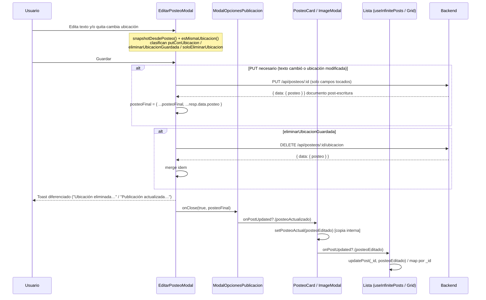

# Documentación del Proyecto: Tlaxcala en Imágenes App (TlaxApp)

> **Versión del documento:** 3 — Generada el **2026-08-26** por el agente `documentador`.
> **Documento previo:** `reports/documentador/2026-08-20_11-05-00.md` (1086 líneas). Documento anterior: `reports/documentador/2026-07-24_12-00-00.md` (1374 líneas).
> **Método:** análisis estático del código fuente real (sin ejecutar la aplicación). Todos los hallazgos son trazables a archivos del proyecto. No se modificó ningún archivo fuente.
> **Enfoque de esta entrega:** actualizar la documentación al ciclo de trabajo recién implementado —**"Edición parcial de posteos y eliminación de ubicación" (2026-08-26)**— reflejando el nuevo contrato del backend y su adopción en el frontend. El ciclo está descrito en `CHANGELOG.md` (sección `[No publicado] — 2026-08-26 · Edición parcial de posteos y eliminación de ubicación`) y **los cambios aún no tienen commit**, tal como lo indica también la nota de esa sección del changelog ("Hashes de commit pendientes de asignar").

---

## 1. Resumen General

**TlaxApp** es una red social de fotografía enfocada en el estado de Tlaxcala, México. Permite a los usuarios compartir fotografías con texto opcional y geolocalización por municipio/localidad INEGI, descubrir lugares, seguir a otras personas y vivir Tlaxcala a través de su gente.

### 1.1 Características principales (verificadas en código)

- Registro y autenticación con verificación de correo electrónico y flujo completo de recuperación de contraseña.
- Publicación de fotografías con texto opcional (máx. 200 caracteres), ubicación por GPS (*reverse geocoding*) o selector manual municipio→localidad, y visibilidad pública/privada.
- **Edición parcial de publicaciones** *(nuevo en este ciclo)*: modal de edición con *dirty tracking* que envía solo los campos modificados al backend (`PUT /api/posteos/:id`), más eliminación dedicada de la ubicación guardada (`DELETE /api/posteos/:id/ubicacion`).
- Feed de publicaciones con scroll infinito (`IntersectionObserver`) y **sincronización de ediciones en las listas** *(nuevo en este ciclo)*.
- Sistema de likes, comentarios (con activación/desactivación por publicación), seguidores y favoritos.
- Perfil de usuario con grid paginado de publicaciones, contadores y modales de seguidores/seguidos.
- Detalle de publicación **público** (compartible) con CTA de registro para visitantes.
- Notificaciones in-app con badge global (polling cada 60 s) y soporte para notificaciones push.
- Gestión de cuenta: editar perfil, cambiar imagen de perfil, eliminar cuenta, ayuda y soporte, preguntas frecuentes.
- Publicidad rotativa (3 anuncios) en la barra lateral de sugerencias.
- SEO completo: metadatos por página, Open Graph, Twitter Cards, JSON-LD, `robots.ts` y `sitemap.ts`.
- Interfaz 100 % en español (`lang="es"`, locale `es_MX`).

### 1.2 Ciclo "Edición parcial de posteos y eliminación de ubicación" (2026-08-26)

Adopción frontend del nuevo contrato del backend:

1. **Edición parcial:** `PUT /api/posteos/:id` acepta un payload con **solo los campos modificados**; los campos vacíos u omitidos significan "no tocar" (nunca borran datos guardados).
2. **Endpoint dedicado de borrado de ubicación:** `DELETE /api/posteos/:id/ubicacion`.
3. **Sincronización con respuestas reales (merge selectivo):** tanto el `PUT` como el `DELETE` responden con `data.posteo`, el documento **post-escritura** (`_idUsuario` poblado), que se fusiona sobre el objeto existente aplicando solo los campos de `CAMPOS_EDICION` (`fusionarCambios`). Se eliminó el objeto optimista que antes se construía en el cliente.
4. **Propagación a las listas contenedoras** (feed de inicio y grid de perfil) mediante la nueva cadena de callbacks `onPostUpdated`.

Secciones donde se documenta el ciclo: §2 (cambios), §7.3 (flujo de datos), §10 (capa API), §11 (`EditarPosteoModal`, `PosteoCard`, `PublicacionUsuario`, `PublicacionesUsuarioGrid`), §12 (`updatePost`), §14 (tipos), §22 (deuda técnica resuelta y vigente) y §23 (comparación con el reporte previo).

---

## 2. Cambios desde la última documentación (2026-08-20)

Comparación entre el reporte previo y el estado actual del código (ciclo del 2026-08-26, *"Edición parcial de posteos y eliminación de ubicación"*):

| # | Cambio | Evidencia |
|---|--------|-----------|
| 1 | **Dirty tracking de ubicación en `EditarPosteoModal`.** Nuevos helpers a nivel de módulo: tipo `SnapshotUbicacion`, función `snapshotDesdePosteo(u)` (normaliza `{municipioId, ciudad, estado, pais, localidadClave, lat, lng}` desde `posteo.ubicacion`) y comparador `esMismaUbicacion(a,b)`. El formulario se compara contra lo guardado justo antes de guardar. | `src/app/components/posteo/EditarPosteoModal.tsx:27-57` y `199-222`. |
| 2 | **Clasificación de operaciones al guardar.** `putConUbicacion` (ubicación elegida Y modificada → el PUT incluye municipio/localidadClave/ciudad/estado/pais + lat/lng si hay GPS), `eliminarUbicacionGuardada` (formulario sin municipio + posteo tenía ubicación → ejecuta además el `DELETE /ubicacion`), `soloEliminarUbicacion` (quitar sin cambio de texto → solo `DELETE`, sin `PUT`). Regla de oro comentada en código: *"Los vacíos en el PUT significan 'no tocar', nunca borrar la ubicación guardada"*. | `EditarPosteoModal.tsx:213-222` y regla en `213-215`; payload construido en `226-242`. |
| 3 | **Integración del endpoint `DELETE /api/posteos/:id/ubicacion`** vía `apiDelete`. Es idempotente según el changelog; el frontend lo llama solo cuando detectó que la ubicación fue quitada del formulario. | `EditarPosteoModal.tsx:256-265`; `CHANGELOG.md` (línea 18). |
| 4 | **Merge selectivo con `fusionarCambios` sobre `data.posteo` real.** Tras cada escritura, `posteoFinal` se actualiza aplicando SOLO los campos que la edición controla (`CAMPOS_EDICION`: `texto`, `ubicacion`, `posteo_publico`, `fecha_actualizacion`, `comentariosCount`) presentes en la respuesta; el resto del objeto ya cargado en memoria se conserva intacto. Se eliminó la construcción optimista del `posteoActualizado` en cliente (corrige "coordenadas fantasma" al re-editar). *Corrección posterior:* el merge ciego `{ ...posteo, ...data.posteo }` pisaba `_idUsuario` — se fijó con `fusionarCambios`; el backend confirmó que `_idUsuario` viene poblado y que los flags de sesión no se computan en escrituras. | `EditarPosteoModal.tsx:62-80` (helpers), `:267-277` (PUT) y `:282-288` (DELETE); `CHANGELOG.md:19,34`. |
| 5 | **Nueva operación de error `'quitar_ubicacion'`** en el union `Operacion` de `apiClient.ts`, con mensaje por defecto "No se pudo quitar la ubicación. Intenta de nuevo." La operación se asigna dinámicamente antes del `DELETE` para que los fallos de esa fase muestren el mensaje correcto. | `src/lib/apiClient.ts:126` (union) y `153` (mensaje); asignación dinámica en `EditarPosteoModal.tsx:194,257`. |
| 6 | **Manejo de errores granular al guardar:** `isNotFound` → "La publicación ya no existe"; `BAD_REQUEST` → `invalidarCatalogos()` + mensaje del backend; `isForbidden` → mensaje específico de permisos; fallback `getUserMessage(err, operacionError)` con operación dinámica. Toasts de error siempre en tipo `danger`. | `EditarPosteoModal.tsx:277-302`. |
| 7 | **Toast diferenciado al guardar:** "Ubicación eliminada correctamente" cuando la única acción fue quitar la ubicación; "Publicación actualizada correctamente" en el resto de los casos. | `EditarPosteoModal.tsx:267-272`. |
| 8 | **Tipos actualizados:** `esExacta?: boolean` agregado a `Posteo.ubicacion`; interfaz obsoleta `EditarPosteoModalProps` **eliminada** de `types.ts` (el modal define su interfaz localmente); `PosteoCardProps` ganó `onPostUpdated?: (posteo: Posteo) => void`. | `src/types/types.ts:32`, `:57-62`; ausencia verificada de `EditarPosteoModalProps` en `types.ts` (archivo completo de 387 líneas); definición local en `EditarPosteoModal.tsx:60-64`. |
| 9 | **Propagación de ediciones a listas.** Nuevo `updatePost(postId, posteoActualizado)` en `useInfinitePosts` (reemplaza el ítem completo del feed). `PublicacionUsuario` lo consume y pasa `onPostUpdated={handlePostUpdated}` a cada `PosteoCard`. `PosteoCard` mantiene copia interna (`setPosteoActual`) e invoca `onPostUpdated?.(posteoEditado)`. `PublicacionesUsuarioGrid` añadió `handlePostUpdated` (map/reemplazo por `_id`) y lo pasa a `<ImageModal>`, que ya soportaba la prop internamente. | `src/app/hooks/useInfinitePosts.ts:67-75,111`; `src/app/components/inicio/PublicacionUsuario.tsx:16,21-22,64`; `src/app/components/PosteoCard.tsx:71-75,252`; `src/app/components/perfil/PublicacionesUsuarioGrid.tsx:189-194,263`. |
| 10 | **Verificación de build:** `pnpm build` exitoso el día del ciclo (artifacts de compilación en `.next/` fechados **26/08/2026 18:14**; `.next/BUILD_ID` presente). El changelog registra Next.js 16.2.12 · Turbopack, compilación + TypeScript OK. | `.next/BUILD_ID` y timestamps de `.next/`; `CHANGELOG.md:45`. |
| 11 | **Sin cambios de dependencias ni rutas respecto del ciclo anterior.** No hay endpoints nuevos de páginas en `.next/app-path-routes-manifest.json` respecto del inventario previo; los cambios son de contratos API y de comportamiento. | `.next/app-path-routes-manifest.json`; `package.json` (sin diffs de versiones). |

---

## 3. Stack Tecnológico

Versiones reales extraídas de `package.json`:

| Tecnología | Versión | Propósito |
|------------|---------|-----------|
| Next.js | 16.2.12 | Framework de React con App Router, SSR/SSG y Server Components |
| React | 19.2.7 | Biblioteca de UI |
| React DOM | 19.2.7 | Renderizado de React en el navegador |
| TypeScript | 6.0.3 | Tipado estático estricto (`strict: true` en `tsconfig.json`) |
| Bootstrap | 5.3.8 | Framework CSS (grid, componentes, utilidades). Importado globalmente en `layout.tsx` |
| Zod | 4.4.3 | Validación de esquemas en formularios y subida de archivos |
| react-hook-form | 7.82.0 | Gestión de formularios (usado en flujos de cuentas/login) |
| @hookform/resolvers | 5.4.0 | Integración de Zod con react-hook-form |
| date-fns | 4.4.0 | Utilidades de fechas (agrupación/formato de notificaciones, según reporte previo verificado) |
| framer-motion | 12.42.2 | Animaciones en modales y toasts |
| react-icons | 5.7.0 | Iconos SVG (set Feather `react-icons/fi`) |
| @popperjs/core | 2.11.8 | Dependencia peer de Bootstrap (posicionamiento de dropdowns); uso indirecto |
| pnpm | 11.15.1 | Gestor de paquetes (declarado en `packageManager`) |

**Nota:** `pnpm-workspace.yaml` declara el paquete raíz como único paquete del workspace (según reporte previo solo permite builds de `sharp`); el proyecto **no es un monorepo**. El bundler en desarrollo y build es **Turbopack** (integrado en Next.js 16; sin webpack config propio).

---

## 4. Requisitos Previos

- **Node.js:** versión compatible con Next.js 16 (se recomienda Node.js 20+). No hay `.nvmrc` ni campo `engines` en `package.json`; no fue posible determinar la versión exacta requerida a partir del código fuente.
- **pnpm:** 11.15.1 (definido en el campo `packageManager`).
- **Archivo `.env`** configurado a partir de `.env.example` (ver sección 5).
- **Backend API** corriendo y accesible (URL en `NEXT_PUBLIC_API_URL`). El frontend consume una API externa autenticada por cookies httpOnly; no incluye el backend.
- **Cuenta de Cloudinary** activa (cloud name en `NEXT_PUBLIC_CLOUDINARY_NAME`), utilizada como servidor de imágenes vía `public_id`.

---

## 5. Instalación y Configuración

```bash
# Clonar el repositorio
git clone <url-del-repositorio>
cd tlaxcala-en-imagenes-app

# Instalar dependencias con pnpm (único gestor soportado)
pnpm install

# Crear el archivo de variables de entorno a partir del ejemplo
cp .env.example .env

# Editar .env con los valores reales (ver sección 5)

# Iniciar el servidor de desarrollo (Turbopack)
pnpm dev

# Compilar para producción
pnpm build

# Servir la compilación de producción
pnpm start
```

---

## 6. Variables de Entorno

Fuente: `.env.example` (único archivo de entorno leído para esta documentación; **no se leyó ningún archivo `.env` activo**) más referencias verificadas a `process.env` en `src/`.

| Variable | Requerida | Utilizada en | Descripción | Ejemplo |
|----------|-----------|--------------|-------------|---------|
| `NEXT_PUBLIC_BASE_URL` | Sí | `layout.tsx:21,42`, metadatos de ~15 páginas (canonicales, OG, sitemap JSON-LD), `ModalOpcionesPublicacion.tsx:47` (enlace compartido), `useEditarPerfil.ts:257` (copiar URL), `(perfil)/[url]/page.tsx:13` | URL pública del frontend para canonical URLs, Open Graph, sitemap y compartir | `https://tlaxapp.com` |
| `NEXT_PUBLIC_API_URL` | Sí | `src/lib/apiClient.ts:1`, `PublicacionUsuario.tsx:18` | URL base del backend; todas las llamadas API se construyen desde aquí mediante `apiUrl()` | `https://api.tlaxapp.com` |
| `NEXT_PUBLIC_CLOUDINARY_NAME` | Sí | `getCloudinaryUrl.ts:23`, `next.config.ts:11` | Cloud name de Cloudinary para construir URLs de entrega de imágenes (y habilitar `remotePatterns`) | `dy9prn3ue` |
| `NEXT_PUBLIC_IMAGEN_PERFIL_DEFAULT` | Sí | `obtenerImagenPerfilUsuario.ts:7` | Referencia de la imagen de perfil por defecto (puede ser `public_id` o URL completa; el loader hace passthrough de URLs completas) | `assets/avatar-default` |
| `NEXT_PUBLIC_IMAGEN_PUBLICIDAD_UNO` | Sí | `PublicidadContext.tsx:8` | URL/public_id de la imagen del anuncio #1 | (URL Cloudinary) |
| `NEXT_PUBLIC_IMAGEN_PUBLICIDAD_DOS` | Sí | `PublicidadContext.tsx:14` | URL/public_id de la imagen del anuncio #2 | (URL Cloudinary) |
| `NEXT_PUBLIC_IMAGEN_PUBLICIDAD_TRES` | Sí | `PublicidadContext.tsx:20` | URL/public_id de la imagen del anuncio #3 | (URL Cloudinary) |
| `CORREO_USUARIO_PRINCIPAL` | No verificable | Sin referencias encontradas en `src/` | Declarada en `.env.example:11` para correos principales. Al carecer del prefijo `NEXT_PUBLIC_` no llega al bundle cliente; su uso sería server-side y **no fue posible verificarlo desde el código analizado** | `soporte@tlaxapp.com` |
| `CORREO_CONTACTO` | No verificable | Sin referencias encontradas en `src/` | Declarada en `.env.example:13` (página de contacto). Ídem arriba | `contacto@tlaxapp.com` |
| `CORREO_LEGAL` | No verificable | Sin referencias encontradas en `src/` | Declarada en `.env.example:15` (documentos legales). Ídem arriba | `legal@tlaxapp.com` |

---

## 7. Scripts Disponibles

| Script | Comando | Descripción |
|--------|---------|-------------|
| `dev` | `next dev` | Servidor de desarrollo (Turbopack) |
| `build` | `next build` | Compilación de producción (Turbopack + chequeo de tipos de TypeScript) |
| `start` | `next start` | Sirve la compilación de producción |

**No existen scripts de lint, typecheck independiente ni pruebas** (AGENTS.md lo confirma y `package.json` solo declara `dev`/`build`/`start`). No hay linter/formatter configurados en el proyecto.

---

## 8. Arquitectura del Proyecto

### 8.1 Estructura de Carpetas

```
tlaxcala-en-imagenes-app/
├── api/                          # Documentación de contratos API del proyecto (ej. api/2026-08-13...-03-posteos.md)
├── next.config.ts                # remotePatterns para res.cloudinary.com (public domain)
├── package.json                  # Scripts dev/build/start; pnpm@11.15.1
├── CHANGELOG.md                  # Historial por ciclos de fechas (incluye el ciclo 2026-08-26)
├── reports/                      # Reportes de subagentes OpenCode (documentador, auditor…)
│   └── documentador/             # ← Este reporte (instantáneas históricas)
└── src/
    ├── components/
    │   ├── ProtectedRoute.tsx    # Guard client-side de rutas protegidas
    │   └── AlreadyAuthRedirect.tsx
    ├── context/                  # 6 proveedores React Context
    │   ├── AuthContext.tsx       # Sesión, refresh de token, fetchWithAuth
    │   ├── NotificacionesContext.tsx   # Badge global (polling 60 s)
    │   ├── FollowContext.tsx     # Mapa isFollowing por usuario
    │   ├── NuevosUsuariosContext.tsx   # Usuarios nuevos (polling 60 s)
    │   ├── PublicidadContext.tsx # Rotación de anuncios (8 s)
    │   └── FavoritoContext.tsx   # Mapa favoritos (montado por grupo de rutas)
    ├── types/
    │   └── types.ts              # Tipos del dominio (Posteo, UsuarioLogueado, ApiResponse<T>…)
    ├── utils/
    │   └── handleChange.ts       # Helper de formularios
    ├── lib/                      # Capa de servicios/utilidades compartidas
    │   ├── apiClient.ts          # Cliente HTTP central + errores RFC 9457 + mensajes
    │   ├── validaciones.ts       # Esquemas Zod y validadores espejo
    │   ├── catalogos.ts          # Caché de catálogo INEGI (municipios/localidades)
    │   ├── etiquetaUbicacion.ts  # Etiqueta "Ciudad · Localidad"
    │   ├── actions.ts            # Server Actions
    │   └── cloudinary/
    │       ├── getCloudinaryUrl.ts        # Construcción de URLs desde public_id
    │       ├── cloudinaryLoader.ts        # Loaders de next/image (feed/detalle/grid/avatar/modal)
    │       └── obtenerImagenPerfilUsuario.ts
    └── app/                      # App Router de Next.js
        ├── layout.tsx            # Raíz: AuthProvider > Notificaciones > Follow > NuevosUsuarios > Publicidad
        ├── page.tsx              # "/" landing pública
        ├── error.tsx, not-found.tsx, robots.ts, sitemap.ts
        ├── inicio/, favoritos/, notificaciones/, configuracion/*, contacto/,
        │   que-es-tlaxapp/, legal/*
        ├── posteo/[idposteo]/    # Detalle público compartible (+ generateMetadata SSR)
        ├── cuentas/*             # Login, registro, recuperación (grupos con sus layouts)
        ├── (perfil)/[url]/       # Grupo de ruta: perfil de usuario en /[url]
        ├── api/                  # Carpeta vacía: NO contiene route handlers
        ├── hooks/                # 12 hooks de dominio (+ auth/logout.ts)
        ├── ui/                   # CSS Modules por área + globals.css + fonts.ts
        └── components/           # Componentes de UI compartidos y por feature
            ├── posteo/           # EditarPosteoModal, ComentariosSection
            ├── inicio/           # PublicacionUsuario (feed)
            ├── perfil/           # ImageModal, PublicacionesUsuarioGrid, …
            └── configuracion/*   # Subcomponentes de ajustes
```

### 8.2 Patrón Arquitectónico

El proyecto sigue un **patrón híbrido: capas técnicas dentro de una organización por rutas/features de App Router**. Evidencia:

1. **Capa de acceso a datos centralizada:** toda llamada HTTP pasa por `src/lib/apiClient.ts` (`apiGet`, `apiPost`, `apiPut`, `apiPatch`, `apiDelete`). El único `fetch` crudo permitido está dentro de `fetchWithAuth` (`AuthContext.tsx:46`) y en `generateMetadata` de `posteo/[idposteo]/page.tsx:15` (Server Component). Esto separa explícitamente *transporte* de *UI*.
2. **Capa de dominio/tipos compartida:** `src/types/types.ts` define los modelos (verificados en el ciclo actual: `Posteo`, `ApiResponse<T>`, `PosteoCardProps`…), consumida transversalmente por todos los features.
3. **Agrupación por feature bajo App Router:** `components/posteo/`, `components/inicio/`, `components/perfil/`, `components/configuracion/` junto a hooks por dominio (`hooks/useInfinitePosts.ts`, `hooks/useComentarios.ts`, etc.) coexisten con carpetas puramente de capa (`lib/`, `context/`, `ui/`): no es *feature-first* puro ni *layer-first* puro.
4. **Estado por contexto inyectado desde layouts:** la raíz anida Auth → Notificaciones → Follow → NuevosUsuarios → Publicidad (`layout.tsx:86-96`) y `FavoritoProvider` se monta en 11 layouts de grupos de rutas (inicio, perfil, posteo, favoritos, notificaciones, configuración y subpáginas) — grep verificado.
5. **Convención de contratos espejo:** validaciones client-side en `validaciones.ts` replican reglas del backend (validación UX; la autoritativa siempre es el backend — comentarios en `catalogos.ts:8-9` y `validaciones.ts:183-184`).

### 8.3 Flujo de Datos — Ciclo actual: edición parcial y propagación

Diagrama de secuencia del flujo implementado hoy en `EditarPosteoModal`:



Flujo general de lectura (vigente, resumido):

```
Layout raíz (providers) → Página (Server Component: metadata/SEO)
  → Cliente: hook (useInfinitePosts/useComentarios…) → apiGet(fetchWithAuth, path)
  → handleApiResponse (res.ok) → Estado local → Componente presentacional
Errores: ApiError(RFC 9457) → getUserMessage(err, operación) → { error, clearError } → UI/toast
```

---

## 9. Enrutamiento

Estrategia: **App Router** de Next.js con grupos de rutas y segmentos dinámicos. La protección de rutas es **client-side** mediante `ProtectedRoute` montado en los *layouts* correspondientes (no hay middleware de Next). Inventario exacto extraído del build real (`.next/app-path-routes-manifest.json`, generado 26/08/2026 18:14) cruzado con los layouts de cada grupo:

| Ruta | Origen (archivo) | Protegida (ProtectedRoute) | Carga diferida | Notas |
|------|------------------|:---:|:---:|-------|
| `/` | `app/page.tsx` | No (redirige a `/inicio` si ya hay sesión vía `AlreadyAuthRedirect`) | Server Component | Landing pública |
| `/inicio` | `app/inicio/page.tsx` + `layout.tsx:16` | **Sí** | Client | Feed (`PublicacionUsuario`) + sugerencias + publicidad; monta `FavoritoProvider` (`layout.tsx:17`) |
| `/[url]` | `(perfil)/[url]/page.tsx` + `layout.tsx:12` | **Sí** | Server wrapper + client | Perfil de usuario por slug; `generateMetadata`; monta `FavoritoProvider` |
| `/posteo/[idposteo]` | `app/posteo/[idposteo]/page.tsx` | No (detalle público) | Server + client (`PosteoPageClient`) | `generateMetadata` SSR con imagen OG desde `getCloudinaryUrl(public_id,"detalle")` (`page.tsx:36`); monta `FavoritoProvider` (`layout.tsx:9`) |
| `/favoritos` | `app/favoritos/page.tsx` + `layout.tsx:31` | **Sí** | Client | Monta `FavoritoProvider` |
| `/notificaciones` | `app/notificaciones/page.tsx` + `layout.tsx:27` | **Sí** | Client | Monta `FavoritoProvider` |
| `/configuracion` | `configuracion/page.tsx` + `layout.tsx:29` | **Sí** | Client | Hub de ajustes |
| `/configuracion/notificaciones` | `layout.tsx:32` | **Sí** | Client | Preferencias push |
| `/configuracion/faq` | `layout.tsx:161` | **Sí** | Client | |
| `/configuracion/ayuda-y-soporte` | `layout.tsx:32` | **Sí** | Client | Formulario de soporte |
| `/configuracion/editar-perfil` | `layout.tsx:31` | **Sí** | Client | Monta `FavoritoProvider` |
| `/configuracion/eliminar-cuenta` | `layout.tsx:33` | **Sí** | Client | Monta `FavoritoProvider` |
| `/contacto` | `app/contacto/page.tsx` | No | Client (metadatos en página) | Formulario contacto |
| `/que-es-tlaxapp` | `app/que-es-tlaxapp/page.tsx` | No | Client | Página informativa |
| `/legal/terminos-y-condiciones` | `app/legal/…/page.tsx` | No | Client (metadatos) | |
| `/legal/politica-de-privacidad` | `app/legal/…/page.tsx` | No | Client (metadatos) | |
| `/legal/preguntas-frecuentes` | `app/legal/preguntas-frecuentes/layout.tsx:19` | No | Client | Fallback de base URL en layout |
| `/cuentas/login` | `cuentas/login/page.tsx` | No (invitados) | Client | Login con bloqueo por intentos (códigos `LOGIN_BLOCKED` manejables vía `isRateLimit`) |
| `/cuentas/login/password-olvidado` | `cuentas/login/password-olvidado/page.tsx` | No | Client | Recuperación (respuesta genérica anti-enumeración) |
| `/cuentas/login/restablecer-password/[token]` | `…/restablecer-password/[token]/page.tsx` | No | Client | Reset con token |
| `/cuentas/crear-cuenta` | `cuentas/crear-cuenta/page.tsx` | No | Client | Registro |
| `/cuentas/crear-cuenta/cuenta-verificada/[token]` | `…/cuenta-verificada/[token]/page.tsx` | No | Client | Verificación por token |
| `/cuentas/confirmacion/correo-enviado` | `…/correo-enviado/page.tsx` | No | Client | Confirmación genérica |
| `/cuentas/confirmacion/password-restablecido` | `…/password-restablecido/page.tsx` | No | Client | Confirmación |
| `/cuentas/confirmacion/correo-enviado-restablecer-password` | `…/correo-enviado-restablecer-password/page.tsx` | No | Client | Confirmación |
| `/favicon.ico` | route handler interno (`app/favicon.ico`) | — | — | |
| `/robots.txt` | `app/robots.ts` | — | Route handler | |
| `/sitemap.xml` | `app/sitemap.ts` | — | Route handler | |

Además existen `_not-found` (global, `app/not-found.tsx`, con `404` por grupo de perfil y detalle) y `_global-error` (manifest del build). 

**Rutas muertas/duplicadas potenciales:** ninguna detectada en este análisis; todas las rutas del manifiesto tienen página fuente correspondiente. La carpeta `src/app/api/` existe pero está **vacía** (sin archivos): no registra handlers en el manifiesto.

---

## 10. Gestión de Estado

No se usa Redux/Zustand/etc.: el estado global es **React Context** (6 proveedores) y el estado de listas es **local (useState + useCallback)** encapsulado en hooks.

### 10.1 AuthContext — `src/context/AuthContext.tsx`

- **Propósito:** sesión del usuario, renovación automática de token y wrapper de peticiones autenticadas.
- **Shape:** `{ user: UsuarioLogueado | null; loading: boolean }` (`AuthContext.tsx:17-18`).
- **Acciones:** `login(user)`, `logout()` (POST `/api/auth/logout`), `updateUser(newData: Partial<UsuarioLogueado>)` (merge parcial en memoria, línea 82-84), `fetchWithAuth(input, init)` (línea 44-72).
- **Efectos secundarios:** inicialización con `GET /api/auth/me` + reintento tras refresh ante 401 (líneas 95-118). `fetchWithAuth`: hasta 3 intentos, si recibe `401` llama `refreshToken()` (POST `/api/auth/refresh`, deduplicado con refs `isRefreshing`/`refreshPromise`, líneas 20-42) y reintenta; backoff lineal entre errores de red (1000·n ms).
- **Particularidad relevante para el ciclo:** `EditarPosteoModal` obtiene `fetchWithAuth` de aquí y lo pasa a `apiPut`/`apiDelete` (`EditarPosteoModal.tsx:71,245,258`).
- **Limpieza de claves de bloqueo:** en `login()` remueve `lastPasswordRequest`, `bloqueoReenvioCorreo`, `passForgetToken`, `registroToken` de storage (líneas 74-80; ver seguridad en §18).

### 10.2 NotificacionesContext — `src/context/NotificacionesContext.tsx`

- **Shape:** `{ totalNoLeidas: number; setTotalNoLeidas; error: string|null; clearError(); refrescarNotificaciones(): Promise<void> }` (líneas 15-21).
- **Efectos:** fetch inicial `GET /api/notificaciones/nuevas-notificaciones` cuando hay usuario y **polling cada 60 s** (líneas 51-55). Errores expuestos con `{error, clearError}` conforme a la convención del proyecto.

### 10.3 FollowContext — `src/context/FollowContext.tsx`

- **Shape:** `{ isFollowingMap: Record<string,boolean>; loadingMap: Record<string,boolean>; toggleFollow(userId, initialFollowing?) }` (líneas 7-11).
- **Acciones:** toggle optimista-simple → `POST /api/followers/follow/:userId` o `DELETE /api/followers/unfollow/:userId` (líneas 30-38); manejo `NOT_FOUND` silencioso con `console.warn`.

### 10.4 NuevosUsuariosContext — `src/context/NuevosUsuariosContext.tsx`

- **Shape:** `{ usuarios: UsuarioNuevo[]; loading; error; clearError; reload(silent?) }`.
- **Efectos:** carga `GET /api/usuarios/registrados/nuevos-usuarios-registrados` (línea 37-41); sincroniza la imagen de perfil del usuario logueado en la lista (líneas 63-72); **polling 60 s pausable** según `visibilitychange` de la pestaña (líneas 77-106).

### 10.5 PublicidadContext — `src/context/PublicidadContext.tsx`

- **Shape:** `{ anuncioActual; indice; pausar(); reanudar() }`.
- **Estado:** array de 3 anuncios cuyas imágenes provienen de `NEXT_PUBLIC_IMAGEN_PUBLICIDAD_UNO/DOS/TRES` (líneas 5-24). Rotación con `setInterval` de **8000 ms** (`reanudar`, líneas 43-48).

### 10.6 FavoritoContext — `src/context/FavoritoContext.tsx`

- **Shape:** `{ favoritosMap: Record<string,boolean>; loadingMap; toggleFavorito(posteoId, autorId, initialFavorito?) }`.
- **Acciones:** `POST /api/favoritos/:posteoId` / `DELETE /api/favoritos/:posteoId` según estado previo (líneas 39-45). Consumido por `ModalOpcionesPublicacion.tsx:30,41` para resolver `esFavoritoGlobal`.
- **Montaje:** provider instanciado en **11 layouts** de grupos de rutas (grep verificado: inicio, posteo/[idposteo], (perfil)/[url], favoritos, notificaciones, configuración + 5 subpáginas).

### 10.7 Estado local de listas (relacionado con el ciclo)

- `useInfinitePosts` (`useInfinitePosts.ts:8-12`): `posts: Posteo[]`, `nextUrl`, `loading`, `finished`, `error`. Acciones: `fetchPosts` (paginación con `pagination.next`), `updateFollowState`, `updateFavoritoState` y **`updatePost`** (§12.1).
- `PublicacionesUsuarioGrid` (`PublicacionesUsuarioGrid.tsx:27-40`): `posteos`, `nextUrl`, deduplicación de páginas con `fetchedPages: Set<string>` y toasts propios.
- `PosteoCard` y `ImageModal` mantienen **copia interna editable** del posteo (`posteoActual`), sincronizadas con la prop `post`/`selectedImage` — clave para que la edición parzial refleje sin recargar.

---

## 11. Capa de API

Todas las llamadas salen por `src/lib/apiClient.ts` (AGENTS.md lo exige; verificado: el único `fetch` crudo está en `AuthContext.tsx:46` y `posteo/[idposteo]/page.tsx:15` para metadata SSR).

### 11.1 Herramientas del cliente (`apiClient.ts`)

| Export | Línea | Descripción |
|--------|-------|-------------|
| `ApiErrorCode` (const + type) | `12-41` | Códigos RFC 9457 esperados (`NOT_FOUND`, `FORBIDDEN`, `BAD_REQUEST`, `VALIDATION_FAILED`, rate limits `*_BLOCKED`…) |
| `ApiError` | `59-69` | Error con `status` y `data` tipado `ApiErrorData` |
| `isApiError/getApiErrorCode/isApiErrorCode/isNotFound/isUnauthorized/isForbidden/isValidationFailed/isRateLimit` | `71-108` | Predicados de clasificación de errores |
| `getApiErrorMessage(err, fallback)` | `110-119` | Extrae `detail/message/error` del cuerpo RFC 9457 |
| `Operacion` (union type) | `121-146` | Operaciones de negocio para mensajes; **incluye `'quitar_ubicacion'` desde este ciclo (línea 126)** |
| `MENSAJES_POR_DEFECTO` | `148-174` | Mensajes por operación; `quitar_ubicacion: 'No se pudo quitar la ubicación. Intenta de nuevo.'` (línea 153) |
| `getUserMessage(err, operacion)` | `176-188` | Prioriza NOT_FOUND → RATE_LIMIT → `detail` → mensaje por operación |
| `handleApiResponse<T>(res)` | `201-217` | Fuente única de verdad: lanza `ApiError` si `!res.ok`; soporta 204 |
| `apiGet / apiPost / apiPut / apiPatch / apiDelete` | `219-304` | Wrappers con `credentials:'include'`, serialización JSON/FormData |

### 11.2 Endpoints invocados desde el frontend (inventario verificado)

| Método | Ruta | Consumidor(es) | Descripción | Autenticación |
|--------|------|----------------|-------------|---------------|
| `POST` | `/api/auth/refresh` | `AuthContext.tsx:32` | Renueva el JWT (cookie) | Cookie httpOnly (via `fetch` crudo) |
| `POST` | `/api/auth/logout` | `AuthContext.tsx:88` | Cierra sesión | Cookie httpOnly |
| `GET` | `/api/auth/me` | `AuthContext.tsx:98,105` | Usuario logueado actual | Cookie (fetchWithAuth) |
| `GET` | `/api/posteos` (paginado) | `useInfinitePosts.ts:24` (URL inicial armada en `PublicacionUsuario.tsx:18`) | Feed global paginado | Sí |
| `POST` | `/api/posteos` (FormData) | `useCrearPosteo.ts:193` | Crear publicación (img, texto, ubicación, `localidadClave`) | Sí |
| `PUT` | `/api/posteos/:id` | `EditarPosteoModal.tsx:244-248` | **Edición parcial**: `{ texto }` siempre trimeado + campos de ubicación **solo si fueron modificados** (`municipio`, `ciudad`, `estado`, `pais`, `localidadClave?`, `lat/lng?` si GPS). Respuesta: `data.posteo` post-escritura | Sí (dueño) |
| `DELETE` | `/api/posteos/:id/ubicacion` | `EditarPosteoModal.tsx:258-261` | **Nuevo**: elimina la ubicación guardada; respuesta `data.posteo` | Sí (dueño) |
| `DELETE` | `/api/posteos/:id` | `ModalOpcionesPublicacion.tsx:72-75` | Eliminar publicación (borra también imagen) | Sí |
| `GET` | `/api/posteos/post/:id` | `PosteoDetalle.tsx:35-38`, `PublicacionesUsuarioGrid.tsx:159` | Detalle de publicación (+`isFollowing`,`isFavorito`) | Opcional (público) |
| `GET` | `/api/posteos/usuario/:usuarioId` | `PublicacionesUsuarioGrid.tsx:71-74` | Grid paginado del perfil | Sí |
| `GET` | `/api/municipios` | `catalogos.ts:30-32` | Catálogo de municipios (cacheado) | Sí |
| `GET` | `/api/municipios/:clave/localidades` | `catalogos.ts:60-65` | Localidades INEGI del municipio (cacheadas) | Sí |
| `POST` | `/api/ubicacion/reverse` | `useObtenerUbicacion.ts:52-60` | Reverse geocoding: coords → municipio + `localidad_cercana` | Sí |
| `POST` | `/api/likes/:postId/like` | `useLikes.ts:23-26` | Toggle like (decide por `msg` — ver §22) | Sí |
| `GET` | `/api/likes/:postId/likes/usuarios` | `PosteoCard.tsx:42-44`, `ImageModal.tsx:86-89`, `useLikesModal.ts:18-21` | Usuarios que dieron like | Sí |
| `POST` | `/api/comentarios/:postId/comentarios` | `useComentarios.ts:119-122` | Comentar (reconcilia comentario temporal) | Sí |
| `GET` | `/api/comentarios/:postId/comentarios` | `useComentarios.ts:54-57` | Lista paginada de comentarios | Sí |
| `GET` | `/api/comentarios/:postId/comentarios/count` | `useComentarios.ts:28-31` | Conteo total | Sí |
| `DELETE` | `/api/comentarios/:commentId` | `useComentarios.ts:146` | Borrar comentario | Sí |
| `PUT` | `/api/comentarios/:id/comentarios/toggle` | `ModalOpcionesPublicacion.tsx:100-104` | Activar/desactivar comentarios del posteo | Sí (dueño) |
| `POST` / `DELETE` | `/api/favoritos/:posteoId` | `FavoritoContext.tsx:40,43` | Añadir/quitar favorito | Sí |
| `POST` / `DELETE` | `/api/followers/follow/:userId` · `/api/followers/unfollow/:userId` | `FollowContext.tsx:30,32` | Seguir/dejar de seguir | Sí |
| `GET` | `/api/notificaciones/nuevas-notificaciones` | `NotificacionesContext.tsx:35-38` | Conteo de no leídas (badge) | Sí |
| `GET` | `/api/usuarios/registrados/nuevos-usuarios-registrados` | `NuevosUsuariosContext.tsx:37-40` | Usuarios nuevos sugeridos | Sí |
| `GET` | `/api/usuarios/:url` | `useUsuarioPerfil.ts:35-38` | Perfil por slug (soporta redirect permanente soft 200) | Sí |

Formas de respuesta tipadas con `ApiResponse<T>` / `ApiResponsePaginado<T>` (`types.ts:78-89`). El contrato completo del PUT y del nuevo DELETE está documentado en `api/2026-08-13_12-50-21_03-posteos.md` (referenciado por `CHANGELOG.md:39`); no fue leído en esta corrida, por lo que los detalles aquí derivan del lado frontend.

---

## 12. Componentes

Documentación focalizada en los componentes del ciclo actual y los reutilizables exportados/consumidos por otros módulos.

### 12.1 EditarPosteoModal ⭐ (núcleo del ciclo)

**Ubicación:** `src/app/components/posteo/EditarPosteoModal.tsx` (477 líneas, `"use client"`).
**Consumido por:** `ModalOpcionesPublicacion.tsx:280-290` (único punto de uso).
**Descripción:** modal animado con *framer-motion* para editar el texto y la ubicación de una publicación, implementando **edición parcial** con dirty tracking de ubicación y borrado dedicado vía endpoint.

**Props (interfaz local `EditarPosteoModalProps`, líneas 60-64):**

| Prop | Tipo | Requerida | Valor por Defecto | Descripción |
|------|------|-----------|-------------------|-------------|
| `isOpen` | `boolean` | Sí | — | Controla visibilidad (render condicional en línea 144) |
| `posteo` | `Posteo` | Sí | — | Documento a editar; fuente del snapshot inicial |
| `onClose` | `(updated: boolean, posteoActualizado?: Posteo) => void` | Sí | — | Callback de cierre; devuelve el documento fusionado si hubo cambios |

**Helpers de módulo (dirty tracking):**

| Nombre | Líneas | Función |
|--------|--------|---------|
| `type SnapshotUbicacion` | `27-35` | Forma normalizada `{ municipioId, ciudad, estado, pais, localidadClave, lat, lng }` (todos `null`-ables) para comparar formulario ↔ guardado |
| `snapshotDesdePosteo(u?: Posteo["ubicacion"])` | `37-48` | Deriva el snapshot desde `posteo.ubicacion`: `municipio→municipioId`, coordenadas GeoJSON `[lng,lat]` → `lat=coords[1]`, `lng=coords[0]` (`null` si faltan) |
| `esMismaUbicacion(a, b)` | `50-57` | Comparación campo a campo por igualdad estricta |

**Estado interno:** `texto` (init `posteo.texto||""`), `loading`, `localidad: SeleccionLocalidad | null` (clave+nombre INEGI), `toastMessage/toastType`; más el estado de ubicación delegado en `useObtenerUbicacion()` (líneas 76-93).

**Efectos secundarios:**
- Auto-limpieza del toast a los 6000 ms (líneas 103-108).
- Hidratación del formulario desde `posteo.ubicacion` al cambiar `posteo`: campos, `localidad{clave,nombre}`, lat/lng desde `coordinates.coordinates` (con limpieza explícita si no hay arreglo válido) o reset completo si no hay ubicación (líneas 110-142; incluye `eslint-disable-next-line react-hooks/exhaustive-deps` en 141).

**Algoritmo de `handleGuardar` (líneas 180-306):**
1. Validación de texto con `editarPosteoSchema.safeParse` (líneas 146-158) y validación espejo `validarUbicacionPost(municipioId, localidad?.clave)` (UX; autoritativa backend) — líneas 184-192.
2. Snapshot: `inicial = snapshotDesdePosteo(posteo.ubicacion)`; `actual` desde el formulario (líneas 199-208).
3. Clasificación (líneas 210-222):
   - `huboCambiosUbicacion = !esMismaUbicacion(inicial, actual)`
   - `putConUbicacion = ubicacionElegida && huboCambiosUbicacion` (Regla de Oro comentada: los vacíos del PUT **nunca** borran la ubicación guardada).
   - `eliminarUbicacionGuardada = !ubicacionElegida && Boolean(posteo.ubicacion) && huboCambiosUbicacion`
   - `textoCambio = texto.trim() !== (posteo.texto || "")`; `soloEliminarUbicacion = eliminarUbicacionGuardada && !textoCambio`
4. Ejecución: si no es `soloEliminarUbicacion`, `apiPut` con body `{ texto }` + (si `putConUbicacion`) `municipio/ciudad/estado/pais`, `localidadClave` solo si hay localidad seleccionada, y `lat/lng` solo con checks estrictos `!== null` (evita descartar coordenada `0`) — líneas 226-242. Después, si corresponde, `apiDelete('/api/posteos/:id/ubicacion')` — líneas 256-265.
5. Merge con respuesta real: `posteoFinal = { ...posteoFinal, ...resp.data.posteo }` (líneas 251-253 y 262-264); conserva flags client-side.
6. Toast diferenciado y cierre diferido 600 ms con `onClose(true, posteoFinal)` (líneas 274-276).
7. **Errores** (líneas 277-302): `isNotFound` → "La publicación ya no existe"; `BAD_REQUEST` → `invalidarCatalogos()` + `getApiErrorMessage(err, "Datos de ubicación inválidos. Vuelve a seleccionar municipio y localidad")`; `isForbidden` → "No tienes permiso para modificar esta publicación" (o `detail` del backend); resto → `getUserMessage(err, operacionError)` con `operacionError` dinámico `'editar_posteo'` → `'quitar_ubicacion'`.

**UI de la sección Ubicación:** botón píldora "Detectar mi ubicación" (`detectarUbicacion`, líneas 171-178: envuelve GPS y adopta `localidadCercana` del backend); botón "Quitar" que limpia el formulario (no persiste hasta Guardar); selector cascada `ManualMunicipioSelector` cuyo `onSelect` **limpia lat/lng al cambiar de municipio** y **conserva al cambiar solo localidad** (comentario líneas 408-413). Títulos con iconos Feather (`FiMapPin`, `FiNavigation`, `FiEdit3`) color `#EBCA9A`.

**Accesibilidad:** etiquetas `title` en botones icónicos; `btn-close` Bootstrap; contador de caracteres visible. Sin roles ARIA personalizados sobre el overlay (usa `position-fixed` + animación; cierre solo por botones Cancelar/btn-close). No hay captura de foco (`focus trap`) ni cierre con Escape explícitos en este modal.
**Responsive:** `maxWidth:500 / width:"90%"`; columnas apiladas; pensado mobile-first.
**Rendimiento:** sin memoización interna (componente pequeño en árbol); animaciones CSS/GPU por framer-motion.

### 12.2 PosteoCard

**Ubicación:** `src/app/components/PosteoCard.tsx` (282 líneas).
**Consumido por:** `PublicacionUsuario.tsx:61-65` (feed), `PosteoDetalle.tsx:70-74` (detalle).
**Descripción:** tarjeta principal de publicación con avatar, enlace al perfil, etiqueta de ubicación, imagen Cloudinary, acciones (likes/comentarios) y modales integrados.

**Props (`PosteoCardProps`, `types.ts:57-62`):**

| Prop | Tipo | Requerida | Valor por Defecto | Descripción |
|------|------|-----------|-------------------|-------------|
| `post` | `Posteo` | Sí | — | Datos de la publicación |
| `isDetail` | `boolean` | No | `false` | Variante página de detalle (imagen eager 1080px, layout amplio) |
| `showUserUrl` | `boolean` | No | `false` | Muestra nombre completo adicional |
| `onPostUpdated` | `(posteo: Posteo) => void` | No | — | **Nueva**: propaga la edición a la lista contenedora |

**Estado interno:** `posteoActual` (copia editable, línea 32), estados de modales de opciones/likes, `loaded` para fade-in de imagen, `showComments`.
**Sincronización del ciclo (`handlePostUpdated`, líneas 71-75):** actualiza su copia con `setPosteoActual(posteoEditado)` **y** propaga `onPostUpdated?.(posteoEditado)`. La prop se pasa internamente a `<ModalOpcionesPublicacion onPostUpdated={handlePostUpdated}>` (línea 252), lo que cierra la cadena EditarPosteoModal → card → lista. En `PosteoDetalle` no se pasa `onPostUpdated` (no hay lista atrás) pero la copia interna sí se actualiza.
**Datos derivados:** `textoUbicacion` vía `formatearEtiquetaUbicacion(posteoActual.ubicacion)` (línea 62); fecha con `Intl.DateTimeFormat("es-MX")` (líneas 77-81); conteo de comentarios/likes con fallbacks (`?? 0`).
**Imágenes:** `next/image` con loaders `avatarPerfilLoader` + `feedLoader`/`detalleLoader`; `alt` descriptivo con autor y texto; `aria-label` en enlaces al perfil; `sizes` responsivos.
**Nota:** implementa su propio `openLikesModal` (líneas 39-56) duplicando lógica de `useLikesModal` (§22).

### 12.3 ModalOpcionesPublicacion

**Ubicación:** `src/app/components/ModalOpcionesPublicacion.tsx` (296 líneas).
**Descripción:** menú contextual Bootstrap de una publicación: compartir (Web Share API), eliminar (confirmación + `apiDelete`), abrir/editar/toggle comentarios (dueño), seguir/favorito (otros usuarios).
**Props:** extiende `PropsModalOpcionesPublicacion` con `onPostDeleted?: (postId: string) => void` y `onPostUpdated?: (posteo: Posteo) => void` (líneas 16-19).
**Rol en el ciclo:** orquesta `EditarPosteoModal` y traduce su `onClose(updated, posteoActualizado)` al callback `onPostUpdated?.(posteoActualizado)` (líneas 279-291). `handleToggleComentarios` (líneas 94-124) aplica actualización local optimista del flag `comentariosActivos` y la propaga también por `onPostUpdated`.
**Deuda menor:** `catch (error: any)` en `handleShare` (línea 61) y comparación de estructura `{ ...selectedImage, comentariosActivos }` como posteo sintetizado (aceptable: no proviene de escritura persistida).

### 12.4 ImageModal (grid de perfil)

**Ubicación:** `src/app/components/perfil/ImageModal.tsx` (507 líneas).
**Descripción:** visor de detalle desde el grid del perfil: imagen grande (`imageModalLoader`, `c_limit` cap 1920), comentarios embebidos, likes y menú de opciones.
**Props (interfaz `PropsImageModal`, líneas 23-29):** `isOpen`, `selectedImage: Posteo | null`, `onClose`, `onPostDeleted?`, `onPostUpdated?: (posteo: Posteo) => void` (ya soportaba la prop internamente; el ciclo conectó el origen desde el grid).
**Efectos secundarios:** bloqueo de scroll con restauración + cierre con Escape (excepto con submodales abiertos), líneas 60-77; detección móvil por `resize`; sincronización `selectedImage → posteoActual` (líneas 48-50).
**Cadena del ciclo:** `handlePosteoActualizado` (líneas 189-195) → `setPosteoActual` + `onPostUpdated(posteoEditado)`; pasa el callback a su `ModalOpcionesPublicacion` interno (línea 485). `PublicacionesUsuarioGrid` ahora se lo entrega (línea 263).
**Accesibilidad:** bloqueo de scroll, Escape, `aria-label` en botones de cerrar/opciones; clicks en overlay cierran (stopPropagation en contenido).

### 12.5 PublicacionUsuario (feed de inicio)

**Ubicación:** `src/app/components/inicio/PublicacionUsuario.tsx` (76 líneas).
**Descripción:** lista del feed con scroll infinito sobre `useInfinitePosts(`${NEXT_PUBLIC_API_URL}/api/posteos`)`.
**Cambios del ciclo:** destructura `updatePost` del hook (línea 16); `const handlePostUpdated = (posteoEditado: Posteo) => updatePost(posteoEditado._id, posteoEditado)` (líneas 21-22); pasa `onPostUpdated={handlePostUpdated}` a cada `PosteoCard` (líneas 60-66).
**Estados vacíos/error:** spinner inicial, empty state "Aún no hay publicaciones", alerta `role="alert"` de error con botón de cerrar (`clearError`).

### 12.6 PublicacionesUsuarioGrid (grid del perfil)

**Ubicación:** `src/app/components/perfil/PublicacionesUsuarioGrid.tsx` (276 líneas).
**Descripción:** grid paginado de publicaciones del usuario con scroll infinito, deduplicación de páginas (`fetchedPages`), apertura del `ImageModal` con recarga fresca del posteo (`GET /api/posteos/post/:id`) y toasts.
**Cambios del ciclo (§ propagación):** nuevo `handlePostUpdated` (líneas 189-194) que reemplaza por `_id` dentro de `setPosteos(prev => prev.map(...))`; la prop `onPostUpdated={handlePostUpdated}` se pasa ahora a `<ImageModal>` (líneas 257-264). Así, al editar desde el visor, el thumbnail del grid queda sincronizado sin recargar.
**Otros:** `handlePostDeleted` filtra y ajusta conteo vía `onPostCountChange?.` (líneas 181-187); toast global local.

### 12.7 ManualMunicipioSelector

**Ubicación:** `src/app/components/ManualMunicipioSelector.tsx` (168 líneas).
**Props verificadas (líneas 19-31):** `municipio: string|null`, `localidadClave?: string|null`, `onSelect(id, data: DatosUbicacion, localidad: SeleccionLocalidad|null)`.
**Descripción:** selector en cascada municipio → localidades INEGI alimentado por caché de `catalogos.ts`; guard `vigente` contra respuestas tardías en ambos efectos (líneas 40-53, 68-80). Es quien dispara la lógica "cambiar municipio abandona GPS" en los modales de crear/editar.

### 12.8 Otros componentes reutilizables (resumen)

| Componente | Ubicación | Props (tipadas en `types.ts`) | Notas |
|------------|-----------|-------------------------------|-------|
| `ProtectedRoute` | `src/components/ProtectedRoute.tsx` | `{ children }` | Redirige a `/cuentas/login` si `!loading && !user` (líneas 15-20); muestra Spinner mientras carga |
| `AlreadyAuthRedirect` | `src/components/AlreadyAuthRedirect.tsx` | `{ children }` | Redirección inversa para landing (usado en `app/page.tsx:17`) |
| `ToastGlobal` | `src/app/components/ToastGlobal.tsx` | `ToastGlobalProps { message; type?; onClose?; duration?; actions? }` (`types.ts:206-212`) | Toast global con framer-motion; usado por EditarPosteoModal (`EditarPosteoModal.tsx:470-474`) |
| `CrearPosteoModal` | `components/CrearPosteoModal.tsx` | `CrearPosteoModalProps { show; onClose; onPostCreated? }` (`types.ts:51-55`) | Crea publicaciones vía `useCrearPosteo` |
| `LikeButton` | `components/LikeButton.tsx` | `LikeButtonProps { postId; likesCount?; hasLiked?; onOpenLikesModal?; readOnly? }` (`types.ts:175-181`) | Botón de like con modal de usuarios |
| `FollowButton` | `components/FollowButton.tsx` | `FollowButtonProps { userId; initialFollowing; className?; onToggle? }` (`types.ts:193-198`) | Usa `FollowContext` |
| `FavoritoButton` | `components/FavoritoButton.tsx` | `FavoritoButtonProps { posteoId; autorId; initialFavorito; className?; onRemoved?; iconOnly? }` (`types.ts:183-190`) | Usa `FavoritoContext` |
| `ModalLikesUsuarios`, `ComentariosModal`, `ComentariosSection` | `components/…` | — | Consumidos por `PosteoCard` (`PosteoCard.tsx:255-279`) |

---

## 13. Hooks Personalizados

### 13.1 useInfinitePosts ⭐ (con nueva `updatePost`)

**Ubicación:** `src/app/hooks/useInfinitePosts.ts` (113 líneas).
**Descripción:** paginación infinita del feed con observador `IntersectionObserver` (`rootMargin: "200px"`, `threshold: 0.1`, líneas 83-93).
**Parámetros:** `initialUrl: string`.
**Retorno:** `{ posts, loading, observerRef, finished, error, clearError, updateFollowState, updateFavoritoState, updatePost }`.
**`updatePost` (nuevo, líneas 67-75):**

```ts
// Reemplaza un posteo completo en el feed tras su edición
const updatePost = useCallback(
  (postId: string, posteoActualizado: Posteo) => {
    setPosts((prev) =>
      prev.map((post) => (post._id === postId ? posteoActualizado : post))
    );
  },
  []
);
```

Es estable (`[]`), sustituye **todo** el ítem (a diferencia de `updateFollowState/updateFavoritoState`, que parchan un solo campo), y expone `clearError` siguiendo la convención `{ error, clearError }` del proyecto.
**Consumo del ciclo:** `PublicacionUsuario.tsx:21-22`.
**Ejemplo de uso real:**

```tsx
const { posts, updatePost } = useInfinitePosts(`${process.env.NEXT_PUBLIC_API_URL}/api/posteos`);
// Al recibir una edición desde PosteoCard:
const handlePostUpdated = (posteoEditado: Posteo) =>
  updatePost(posteoEditado._id, posteoEditado);
```

### 13.2 useObtenerUbicacion

**Ubicación:** `src/app/hooks/useObtenerUbicacion.ts` (110 líneas). Geolocalización del navegador (`enableHighAccuracy`, timeout 5000) → `POST /api/ubicacion/reverse` → estado `{municipioId, ciudad, estado, pais("México"), lat, lng, localidadCercana}` con setters expuestos. Retorna objeto con resultados (usado por `detectarUbicacion` en crear/editar).

### 13.3 useComentarios

**Ubicación:** `src/app/hooks/useComentarios.ts` (172 líneas). Parámetro `postId`. Retorno `{ comentarios, total, loadingList, loadingMore, hasMore, error, clearError, fetchComentarios, fetchTotal, cargarMasComentarios, agregarComentario(texto), eliminarComentario(id) }`. Incluye inserción optimista de comentario con `temp_${Date.now()}` y reconciliación con `_id` real (líneas 100-131); rollback en error (138-140).

### 13.4 useCrearPosteo

**Ubicación:** `src/app/hooks/useCrearPosteo.ts` (262 líneas). Parámetros `(onPostCreated?, onSuccess?)`. Maneja archivo+preview, validación Zod, FormData completo (`municipio`, `localidadClave`, `lat/lng` con check truthy — diferencia documentada respecto del edit en `CHANGELOG.md:26`) y `invalidarCatalogos()` ante `BAD_REQUEST` (201-210).

### 13.5 Resto de hooks

| Hook | Ubicación | Parámetros | Retorno verificado | Notas |
|------|-----------|------------|--------------------|-------|
| `useLikes(postId, initialCount?, initialHasLiked?)` | `useLikes.ts:10-42` | — | `{ likeState:{count,hasLiked}, toggleLike, loading:false }` | Decide estado a partir de `data.msg === "Like añadido"/"Like eliminado"` (§22) |
| `useLikesModal()` | `useLikesModal.ts:8-45` | — | `{ isLikesOpen, likesUsuarios, loading, openLikesModal(postId), closeLikesModal() }` | Duplicado parcialmente en `PosteoCard` |
| `useUsuarioPerfil(url)` | `useUsuarioPerfil.ts:13-92` | slug | `{ usuario, loading, error, isNotFoundError, redirectMessage, clearError, clearRedirectMessage, setUsuario }` | Soporta redirect permanente `replaceState` |
| `useEditarPerfil()` | `useEditarPerfil.ts:62` (exporta también `perfilSchema`, línea 11) | — | No analizado detalle completo en esta corrida (usa `NEXT_PUBLIC_BASE_URL` en línea 257) | Cooldown renombre 30 días (doc. previa) |
| `useNotifications()` | `useNotifications.tsx:8` | — | No analizado detalle en esta corrida | Contexto de notificaciones UI |
| `usePushNotifications()` | `usePushNotifications.ts:8` | — | No analizado detalle en esta corrida | Web Push/VAPID según doc. previa |
| `useLogout()` | `hooks/auth/logout.ts:4-14` | — | `{ handleLogout() }` | `logout()` + `router.push("/cuentas/login")` |
| `useAuth()` / `useFavorito()` / `useFollow()` / `useNotificaciones()` / `useNuevosUsuarios()` / `usePublicidad()` | contextos (§10) | — | Estado del contexto | Lanzan error fuera del provider |

---

## 14. Utilidades y Helpers

| Módulo | Exporta (verificado) | Propósito | Casos borde cubiertos |
|--------|----------------------|-----------|------------------------|
| `src/lib/apiClient.ts` | Ver tabla §11.1 | Transporte HTTP + normalización de errores RFC 9457 + mensajes de usuario | 204 sin cuerpo; content-type no JSON; reintentos de red en `fetchWithAuth` (capa Auth) |
| `src/lib/validaciones.ts` | `MAX_IMAGEN_BYTES/MIME/EXTENSIONS` (8-11), `usuarioSchema`, `correoSchema`, `passwordSchema`, `resetPasswordSchema`, `posteoBaseSchema`, `posteoSchema`, **`editarPosteoSchema`** (101-120: max 200, regex permisivo de vacío, anti-spam `spamRegex`), `schemaAyudaSoporte`, `comentarioSchema`, `imageFileSchema`, `REGEX_NOMBRE/MAX_NOMBRE`, `validarNombre`, `REGEX_CLAVE_LOCALIDADES`… concretamente `REGEX_CLAVE_LOCALIDAD=/^\d{4}$/` (185) y **`validarUbicacionPost(municipioId?, localidadClave?)`** (187-199) | Validación espejo de formularios (autoritativa: backend) | Texto vacío permitido en edición; clave de localidad requiere municipio |
| `src/lib/catalogos.ts` | `getMunicipios`, `getLocalidades(claveMunicipio)`, `invalidarCatalogos(claveMunicipio?)` (84-91) | Caché en memoria del tab (muere al recargar), deduplicación in-flight | Invalidación selectiva (por municipio) o global (tras 400) |
| `src/lib/etiquetaUbicacion.ts` | `formatearEtiquetaUbicacion(ubicacion)` | Etiqueta "Ciudad · Localidad" para cards/modales; retrocompatible con posts antiguos (`localidadNombre: null` → "ciudad, estado, país") | `null` seguro; filtro de valores falsos |
| `src/lib/cloudinary/cloudinaryLoader.ts` | `createCloudinaryLoader(preset, opts)` + loaders `avatarPerfilLoader` (cap 200), `avatarMiniLoader` (cap 120), `feedLoader` (**aspectRatio 1.25, cap 1080, gravity auto** — líneas 73-77; ver discrepancia con AGENTS.md en §23), `detalleLoader` (cap 1080), `gridLoader` (cap 400), `imageModalLoader` (custom `c_limit`, cap 1920, fondo negro) | Loaders de `next/image` que bypassan el optimizer: passthrough de URLs http/blob/data/ruta relativa (línea 39); `q_auto,f_auto` inyectados (`quality:"auto", format:"auto", useAutoTransforms:true`, líneas 54-56) | src vacío; caps anti-srcset gigantes |
| `src/lib/cloudinary/getCloudinaryUrl.ts` | `getCloudinaryUrl(src, preset, opciones?)` | Construye URLs de entrega desde `public_id` con `NEXT_PUBLIC_CLOUDINARY_NAME` (línea 23). Usado directo en OG/Twitter (`posteo/[idposteo]/page.tsx:36`) | Detalles internos no releídos en esta corrida (ver doc. previa §Cloudinary) |
| `src/lib/cloudinary/obtenerImagenPerfilUsuario.ts` | `DEFAULT_PROFILE_IMAGE` (línea 7), `obtenerImagenPerfilUsuario(usuario)` | Devuelve **src** (public_id o default) para el avatar; loader resuelve la URL | Sin `imagen_perfil.public_id` |
| `src/utils/handleChange.ts` | `handleChange` | Helper genérico onChange de formularios | Consumido por `FormularioRegistro` (según doc. previa) |
| `src/lib/actions.ts` | Server Actions (contenido no analizado en esta corrida) | — | — |

---

## 15. Sistema de Tipos

TypeScript 6 estricto (`strict:true`, `tsconfig.json`). Modelos centralizados en `src/types/types.ts` (387 líneas).

- **Genéricos de respuesta:** `ApiResponse<T>` y `ApiResponsePaginado<T>` con `Pagination` (líneas 68-89). El ciclo usa `ApiResponse<{ posteo: Posteo }>` en ambas escrituras (`EditarPosteoModal.tsx:244,258`).
- **`Posteo` (líneas 21-49):** `ubicacion?` con `municipio?`, `ciudad?`, `estado?`, `pais?`, `localidadClave?/localidadNombre?` (posts antiguos: `null`) y **`esExacta?: boolean` — nueva** (línea 32: *"true solo si la ubicación provino de GPS (coordenadas redondeadas a 3 decimales)"*), `coordinates?: { type:"Point"; coordinates:[number,number] }` orden GeoJSON `[lng,lat]`. Flags client-side mezclados con datos de dominio (`isFollowing`, `isFavorito`, `likesCount?`, `hasLiked?`, `comentariosActivos?`): decisión práctica que habilita el merge del ciclo sin perder estado computado.
- **Cambios del ciclo:** `PosteoCardProps.onPostUpdated?` añadido (línea 61); **eliminada** la interfaz obsoleta `EditarPosteoModalProps` que nadie consumía y estaba desincronizada (confirmado por ausencia en todo el archivo; el modal define su interfaz local en `EditarPosteoModal.tsx:60-64`).
- **Usos débiles detectados:**
  - `catch (error: any)` en `ModalOpcionesPublicacion.tsx:61` (único `any` implícito encontrado en los archivos analizados).
  - Type assertions de necesidad objetiva: `params as { idposteo?: string } | null` (`PosteoDetalle.tsx:14`); `data.data as { usuario?: … ; redirect?: … }` (`useUsuarioPerfil.ts:40`); estilo CSS `as CSSProperties` para variable custom (`PosteoCard.tsx:177`).
  - Tipos posicionales anónimos en props inline (`ManualMunicipioSelector.tsx:23-31`) — legibles pero no reutilizables.
- **`body: Record<string, unknown>`** en `EditarPosteoModal.tsx:227`: flexible ante el contrato parcial, sacrificando un payload tipado dedicado (posible mejora: tipo `EditarPosteoPayload`).

---

## 16. Estilos y Diseño

- **Estrategia:** Bootstrap 5.3 importado globalmente (`layout.tsx:4` — solo CSS; JS de Bootstrap no se importa en layout, los modales propios usan clases/markup manual) + **CSS Modules** por área en `src/app/ui/**` (`PosteoCard.module.css`, `perfil.module.css`, `Inicio.module.css`, `globals.css`, etc. — inventario §8.1).
- **Identidad visual:** monocromática con acento marca `#EBCA9A` (iconos y botón GPS en modales, `EditarPosteoModal.tsx:346,429`; hint de rediseño 2026-08-25 en `CHANGELOG.md:49-58`).
- **Responsive:** mobile-first; viewport con `userScalable:false` y escala fija 1 (`layout.tsx:70-75`); breakpoints Bootstrap (`col-6 col-sm-6 col-md-4 col-lg-4` en el grid, `PublicacionesUsuarioGrid.tsx:220`); ramas móvil/desktop dentro de `ImageModal` con umbral `window.innerWidth < 768` (línea 53).
- **Animaciones:** `framer-motion` en overlays/scale (`AnimatePresence`), fade-in de imágenes vía CSS Modules (`loaded ? fadeIn : hidden`).
- **Temas/dark mode:** no hay mecanismo de tema alternativo detectado en el código analizado.

---

## 17. Rendimiento y Optimización

- **Scroll infinito nativo:** `IntersectionObserver` en `useInfinitePosts` y `PublicacionesUsuarioGrid` (rootMargin 200px); sin librerías externas.
- **Code splitting / lazy loading:** implícito por App Router (Server Components + Client Components `"use client"`); no se detectan `React.lazy`/`dynamic()` explícitos en los archivos analizados. Los modales críticos están siempre importados (trade-off asumido).
- **Imágenes:** entregadas por Cloudinary con transformaciones `q_auto,f_auto` y caps por contexto (§14); `sizes` correctos; `priority` solo en imágenes above-the-fold (grid/detalle/OG del hero). El optimizer de Next queda bypassado por diseño (loaders personalizados) — la directiva `remotePatterns` solo aplica a imágenes sin loader (p. ej. publicidad).
- **Memoización:** `useCallback` consistente en callbacks de hooks y handlers dependientes (`updatePost` estable, `fetchPosts` con deps correctas); sin `React.memo` en cards (riesgo menor de re-render en el feed al editar un item: el replace completo remonta el `PosteoCard` afectado).
- **Deduplicación de requests:** catálogo INEGI in-flight share (`catalogos.ts`); refresh de token deduplicado (`AuthContext` refs); polling pausable por visibilidad (`NuevosUsuariosContext`).

---

## 18. Consideraciones de Seguridad

- **Autenticación:** JWT por **cookies httpOnly** (`credentials:'include'` en todos los wrappers `apiClient.ts:234,247,…`); sin tokens en localStorage/sessionStorage para la sesión. Solo claves de UX/cooldown en storage removidas al login (`AuthContext.tsx:74-80`).
- **Renovación:** cola deduplicada de `refresh` ante 401; logout limpia memoria (`user=null`) aunque falle el endpoint.
- **Autorización visual:** `ModalOpcionesPublicacion` distingue dueño (`user.uid === selectedImage._idUsuario._id`, línea 40) vs visitante vs público; la autorización real es backend (el ciclo maneja `403 FORBIDDEN` con mensaje específico, `EditarPosteoModal.tsx:292-296`).
- **Anti-enumeración:** la página de recuperación asume respuesta genérica; el frontend no verifica existencia de cuentas en ese flujo (convención AGENTS.md; `isNotFound` **no** se trata como revelador allí).
- **Sanitización/XSS:** no hay `dangerouslySetInnerHTML` en los archivos del análisis; texto renderizado como nodos React; Zod valida entrada (regex blancas) — riesgo residual bajo en lo analizado.
- **Secretos:** ninguna llave privada en cliente (Cloudinary solo sirve delivery público). Las variables `CORREO_*` no llegan al bundle (prefijo sin `NEXT_PUBLIC_`).
- **Hallazgo menor:** `navigator.share` invocado dos veces secuencialmente en `handleShare` (`ModalOpcionesPublicacion.tsx:55-60`) — el segundo `await navigator.share(...)` es redundante/código muerto; sin impacto de seguridad, sí de claridad.

---

## 19. Pruebas

- **Herramientas de testing:** ninguna. No hay `vitest`/`jest`/playwright ni tests en el repo (`package.json` sin scripts ni devDependencies de test; AGENTS.md: *"No test infrastructure at all"*).
- **Verificación disponible:** `pnpm build` (Next 16 · Turbopack + TypeScript) como único gate de calidad automatizado; build exitoso el 26/08/2026 18:14 (artefactos `.next/BUILD_ID`).
- **Matriz manual pendiente:** el changelog del ciclo deja registrada la tarea pendiente de ejecutar la matriz de pruebas §5 de las specs (escenarios 1–10) contra el backend de desarrollo (`CHANGELOG.md:45`).
- Convenciones de pruebas: _Esta sección no aplica para este proyecto._

---

## 20. Despliegue

- **Build:** `pnpm build && pnpm start` (servidor Node de Next). El runtime objetivo no está declarado (no hay Dockerfile/vercel.json en la raíz analizada; no fue posible determinar la plataforma de despliegue desde el código).
- **Variables requeridas en producción:** todas las `NEXT_PUBLIC_*` de §6 (se hornean en el bundle en tiempo de build — cambiarlas exige rebuild).
- **Configuración detectada:**
  - `next.config.ts`: `images.remotePatterns` para `https://res.cloudinary.com/<NEXT_PUBLIC_CLOUDINARY_NAME>/**` (necesario para imágenes sin loader).
  - `metadataBase` con fallback `http://localhost:3000` (`layout.tsx:21`) — fijar `NEXT_PUBLIC_BASE_URL` en producción para evitar metadatos locales.
  - ISR/SSG: `generateMetadata` del detalle usa `next:{revalidate:60}` (`posteo/[idposteo]/page.tsx:16`).
  - SEO: `robots.ts` + `sitemap.ts` generan los route handlers `/robots.txt` y `/sitemap.xml` del manifiesto.

---

## 21. Salud de Dependencias

### Dependencias No Utilizadas
Ninguna confirmada. Revisión de las 11 dependencias de `package.json` contra imports verificados:
`next`, `react`, `react-dom`, `bootstrap`, `zod`, `react-hook-form` + `@hookform/resolvers` (flujos de cuentas), `framer-motion`, `react-icons`, `date-fns` (notificaciones, doc. previa) tienen uso. `@popperjs/core` es dependencia peer indirecta de Bootstrap (uso no directo en código fuente).

### Dependencias Faltantes
Ninguna detectada: no se encontraron imports de paquetes no declarados en los archivos analizados.

### Herramientas Duplicadas
- **Validación de formularios:** conviven el patrón `useState` + `safeParse` manual (modales de posteo, comentarios) y `react-hook-form` + resolvers (flujos de cuentas). Dos paradigmas para el mismo problema — no es conflicto funcional, pero duplica la curva de mantenimiento.
- **Modal de likes:** `useLikesModal` vs lógica duplicada dentro de `PosteoCard.openLikesModal` (ver §22).
- Una sola solución de transporte (`apiClient`) y una de estilos estructural (Bootstrap+CSS Modules): sin duplicación.

---

## 22. Código No Utilizado

Metodología: búsqueda de consumidores (imports/referencias) en `src/`. El análisis estático no puede confirmar usos dinámicos, por lo que los hallazgos son potenciales.

| Elemento | Tipo | Clasificación | Evidencia |
|----------|------|---------------|-----------|
| `PublicacionesUsuarioGridItem.tsx` | Componente | **Potencialmente no utilizado** | Definición en `src/app/components/PublicacionesUsuarioGridItem.tsx:12` (`export default function PublicacionesUsuarioGridItem({ posteo, onClick })`); grep de `PublicacionesUsuarioGridItem` en `src/*.tsx` arroja solo su propia declaración. El grid actual renderiza tarjetas inline (`PublicacionesUsuarioGrid.tsx:219-235`) sin usarlo |
| Carpeta `src/app/api/` | Directorio | Vacía (código muerto de infraestructura) | Glob `src/app/api/**/*` → sin archivos; tampoco aparece en el manifiesto de rutas del build |
| `useCrearPosteo`: `showConfirmDiscard/setShowConfirmDiscard` | Estado de hook | Usado por el modal (`CrearPosteoModal`) | Se mantiene como usado (retorno del hook, líneas 230,237); no se marca |
| `'default'` en `Operacion` | Case de union | **Potencialmente no utilizado** | Ningún consumidor le pasa `'default'` en los archivos leídos; funciona como red de seguridad del `Record<Operacion,string>` |

Eliminados durante el ciclo (resueltos, ya no aplican): interfaz `EditarPosteoModalProps` de `types.ts` (§15) y objeto optimista de `posteoActualizado` en el cliente (`CHANGELOG.md`, secciones Corregido/Eliminado de specs backend).

---

## 23. Deuda Técnica Detectada

| # | Incidencia | Tipo | Ubicación | Detalle |
|---|------------|------|-----------|---------|
| 1 | Componente oversized (>300 líneas): `ImageModal.tsx` (507) | Mantenibilidad | `components/perfil/ImageModal.tsx` | Ramas móvil/desktop duplicadas casi en su totalidad; candidatos claros de extracción |
| 2 | Componente oversized: `EditarPosteoModal.tsx` (477) | Mantenibilidad | `components/posteo/EditarPosteoModal.tsx` | El algoritmo de clasificación + errores ocupa 126 líneas (180-306); podría extraerse a hook/testeable |
| 3 | TODO en estilos | Deuda anotada | `ui/perfil/perfil.module.css:137` | "TODO: RECORDAR QUE SON ESTILOS DIFERENTES LOS BOTONES DE SEGUIR/DEJAR DE SEGUIR…" |
| 4 | Directiva eslint-disable | Supresión de regla | `EditarPosteoModal.tsx:141` (`exhaustive-deps`) | Depende de comentario; el efecto usa setters de `useObtenerUbicacion` estables |
| 5 | `catch (error: any)` | Tipado débil | `ModalOpcionesPublicacion.tsx:61` | Único `any` encontrado en archivos analizados |
| 6 | Comparación de cadenas de mensajes para decidir estado | Fragilidad de contrato | `useLikes.ts:28-31` | Decide `count/hasLiked` a partir de `data.msg === "Like añadido"/"Like eliminado"` — viola el espíritu de la convención del proyecto ("Never compare error message strings"); un cambio de copy rompe el contador |
| 7 | Lógica de modal de likes duplicada | DRY | `PosteoCard.tsx:39-56` vs `useLikesModal.ts` | Mismo patrón de fetch + estados reimplementado |
| 8 | Check truthy de coordenadas al crear vs estricto al editar | Inconsistencia | `useCrearPosteo.ts:190-191` (`if(lat)`) vs `EditarPosteoModal.tsx:238` (`!== null`) | El caso editar corrigió el descarte de valor `0` (CHANGELOG:26); crear aún usa truthy |
| 9 | Comentarios triviales/ruido | Calidad | `PublicacionesUsuarioGrid.tsx:1` (`// FUFUFU`), `EditarPosteoModal.tsx:59,96`, emojis de progreso en comentarios | Cosmético |
| 10 | `handleShare` con llamada doble a `navigator.share` | Código muerto lógico | `ModalOpcionesPublicacion.tsx:55-60` | Ramas if/else idénticas |
| 11 | Carpeta `src/app/api/` vacía | Higiene | `src/app/api/` | Remover o documentar propósito |
| 12 | Payload del PUT tipado como `Record<string, unknown>` | Tipado aprovechable | `EditarPosteoModal.tsx:227` | Un tipo dedicado daría seguridad de contrato |
| 13 | Dependencias circulares | — | — | No detectables con el análisis estático realizado (ninguna herramienta de grafo disponible); `types.ts ← validaciones.ts` y contexts ⇄ `apiClient` no forman ciclos evidentes |

**Resuelto en este ciclo** (para trazabilidad): eco de campos vacíos reconstruyendo/borrando ubicación → corregido con contrato parcial; coordenadas fantasma al re-editar → corregido usando `data.posteo`; corrupción de `_idUsuario` por merge ciego → corregido con `fusionarCambios` (el backend confirmó `_idUsuario` poblado en escrituras y flags de sesión no computados, `comentariosCount` autoritativo); interfaz obsoleta eliminada; inconsistencia `g_face/c_fill` histórica permanece corregida por filtrado de `undefined` en merges de opciones (doc. previa + AGENTS.md).

---

## 24. Problemas Conocidos y Limitaciones

1. **Cambios sin commit:** el ciclo 2026-08-26 está totalmente implementado y el build pasó, pero según lo informado y según `CHANGELOG.md:45` ("hashes de commit pendientes") los cambios **aún no están versionados**. Este reporte describe el working tree actual, no un estado taggeado.
2. **Comparación con el reporte previo (`2026-08-20_11-05-00.md`, 1086 líneas):**
   - **No hay cambios estructurales de rutas**: mismo inventario de páginas (manifiesto del build identificado en §9); ni rutas nuevas/eliminadas.
   - **No hay stores/contextos nuevos**: continúan los 6 proveedores; sin migración de librería de estado.
   - **Sin cambios de dependencias** (ni nuevas ni versionadas): `package.json` idéntico al previsto en la doc v2.
   - **Superficie del ciclo:** 1 unión de `Operacion` ampliada (`quitar_ubicacion`), 1 prop de tipo nueva (`PosteoCardProps.onPostUpdated`), 1 campo de dominio (`Posteo.ubicacion.esExacta`), 1 endpoint nuevo integrado (`DELETE /posteos/:id/ubicacion`), helpers module-level nuevos en `EditarPosteoModal`, 1 hook con retorno ampliado (`updatePost`) y wiring de propagación en 5 componentes.
3. **Discrepancia documental detectada:** `AGENTS.md` describe `feedLoader` con "cap 800"; el código real usa `aspectRatio: 1.25, cap: 1080, gravity: "auto"` (`cloudinaryLoader.ts:73-77`). Para el análisis se consideró válida la implementación; conviene actualizar AGENTS.md. La nota de `avatarPerfilLoader` (200) coincide. La doc. previo-v3 citaba `imageModalLoader` con cap 1920 — consistente con el código actual.
4. **Limitaciones del método:** análisis estático (sin runtime); no se leyeron `.env` activos por política; archivos no leídos en esta corrida (`getCloudinaryUrl.ts` interno, `actions.ts`, pantallas de cuentas/configuración completas, `Publicidad.tsx`, headers/footers) heredan descripción del reporte v2 y quedan señalados donde aplica ("no analizado en detalle"). El build ya validó tipos, lo cual reduce (mas no elimina) incertidumbre sobre esos puntos.
5. **Cobertura de hooks:** 9 de 12 hooks completamente trazados; `useEditarPerfil`, `useNotifications` y `usePushNotifications` documentados a nivel firma/propósito (§13.5).

---

## 25. Convenciones del Proyecto

- **Idioma:** UI, comentarios y commits 100 % en español; `lang="es"`; locale `es_MX`; formatos de fecha `Intl.DateTimeFormat("es-MX")`.
- **Nomenclatura:** componentes PascalCase; hooks prefijo `use*`; utilidades camelCase en kebab/snake según dominio (`getUserMessage`, `getCloudinaryUrl`); tipos/interfaces del dominio concentradas en `types.ts` con sufijos `Props`/`Response`.
- **Carpetas:** `lib/` para servicios compartidos; `context/` para estado global; hooks junto a `app/hooks/` con subcarpeta `auth/`; CSS Modules espejando `components/` en `ui/`.
- **Transporte:** siempre `apiGet/apiPost/apiPut/apiPatch/apiDelete(fetchWithAuth, path)`; nunca comparar strings de error para lógica de navegación; usar predicados `isNotFound/isForbidden/isRateLimit/isApiErrorCode`; exposición uniforme `{ error: string | null; clearError }` en hooks y contexts; mensajería por `getUserMessage(err, operacion)` con operación dinámica cuando hay múltiples fases (patrón introducido por `editar_posteo`→`quitar_ubicacion`).
- **Escrituras:** preferir documentos post-escritura (`data.posteo`) sobre construcción optimista; sincronizar con **merge selectivo** (`fusionarCambios`: aplicar solo los campos de `CAMPOS_EDICION` presentes, incluido `comentariosCount` que es autoritativo; `_idUsuario` viene poblado y los flags de sesión se conservan del estado previo); propagar cambios de entidad hacia contenedores vía `onPostUpdated/onPostDeleted` (cadena Modal → Card/Modal-imagen → lista).
- **Ubicación:** el frontend nunca envía nombres de localidad, solo `clave INEGI` de 4 dígitos; GPS ⇒ `esExacta`, cambio de municipio abandona coordenadas; `lat/lng` solo si hay coordenada real (checks estrictos).
- **Commits/build:** convención describir fase + `pnpm build` verde antes de cerrar ciclo (práctica observada en CHANGELOG); pnpm obligatorio.
- **OpenCode:** carpeta `reports/` reservada para subagentes (este documento vive en `reports/documentador/`).

---

## 26. Glosario

| Término | Explicación |
|---------|-------------|
| *App Router* | Paradigma de enrutamiento de Next.js basado en el sistema de archivos de `app/` con layouts anidados y Server Components |
| *Dirty tracking* | Comparación del estado actual del formulario contra un snapshot guardado para decidir qué campos enviar; implementado aquí con `SnapshotUbicacion`/`esMismaUbicacion` |
| *public_id* | Identificador de un asset en Cloudinary; las URLs de entrega se construyen desde él (el backend no envía `secure_url`) |
| *Loader de next/image* | Función personalizada que genera la URL final por breakpoint; aquí bypassa el optimizador de Next y sirve Cloudinary directo |
| RFC 9457 / *Problem Details* | Formato estándar de errores HTTP (`code`, `detail`, `status`, `type`…) que estandariza el backend y normaliza `apiClient.ts` |
| INEGI (clave de localidad) | Código geográfico mexicano de 4 dígitos ("0024") que identifica una localidad dentro de un municipio; el frontend solo envía la clave |
| *Reverse geocoding* | Conversión de coordenadas GPS en nombres de lugar; aquí vía `POST /api/ubicacion/reverse` con sugerencia de localidad cercana |
| *Optimistic update* | Actualizar la UI antes de confirmar en servidor; eliminado deliberadamente en edición de posteos a favor de `data.posteo` real |
| *Merge* post-escritura | Fusión `{ ...objetoPrevio, ...respuestaServidor }` para aplicar el documento persistido conservando campos calculados en cliente |
| Context Provider | Componente React que expone estado/acciones globales vía `createContext`; seis actuales (§10) |
| ProtectedRoute | Guard client-side que impide render de rutas privadas sin sesión |
| Turbopack | Bundler de Next.js 16 usado en `dev` y `build` |
| *Code splitting* | División automática del bundle por ruta propia del App Router |
| *IntersectionObserver* | API de browser para detectar visibilidad de elementos; base del scroll infinito |
| `esExacta` | Flag de `Posteo.ubicacion` (nuevo): la ubicación proviene de GPS con coordenadas redondeadas a 3 decimales |

---

*Fin del reporte. Instantánea generada el 2026-08-26; reportes previos preservados: `2026-07-24_12-00-00.md`, `2026-08-20_11-05-00.md`.*
